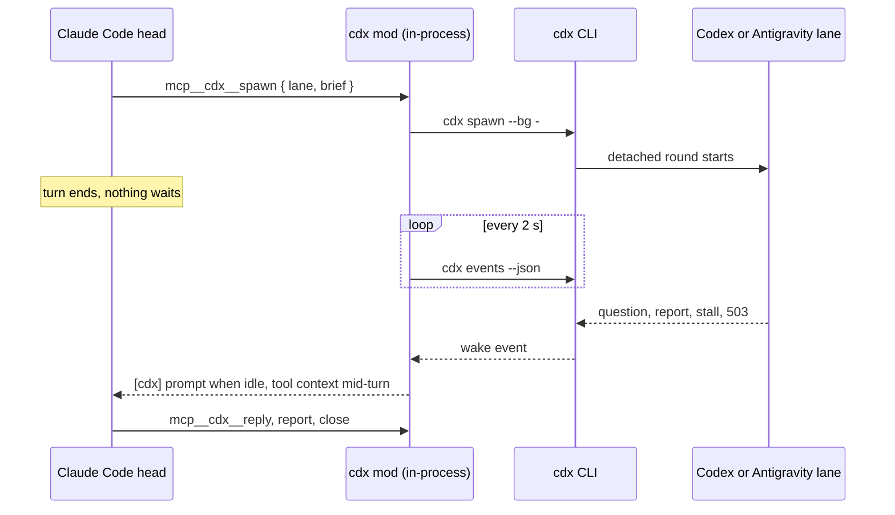
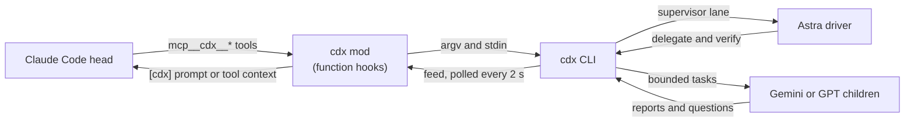

<div align="center">

# cdx 8.0.0

**A native Claude Code plugin that runs OpenAI Codex and Google Antigravity as execution lanes.**

Claude is the head. Astra drives. Gemini executes. cdx keeps the books and wakes the head when a lane needs it.

[](#native-in-claude-code)
[](#registered-tools)
[](CHANGELOG.md)
[](https://bun.sh)
[](cdx.ts)
[](LICENSE)


</div>

cdx is a [Claude Code](https://claude.com/claude-code) plugin and a standalone CLI for [OpenAI Codex](https://github.com/openai/codex) and Google Antigravity lanes. Claude Code is the owner's liaison. It briefs an outcome to one Astra supervisor, answers questions, arranges independent review, and merges. Astra owns design and implementation and delegates bounded work to Gemini. cdx records lane state, reports, questions, logs, and token use.

## Native in Claude Code

cdx 7.0 runs inside Claude Code as a [function hooks](#claude-code-integration) module, not as a shell wrapper. When a session starts, the mod registers tools under `mcp__cdx__`, the `/lanes` command, a status line, and a two-second poll of the event feed. The head spawns a lane with one tool call and ends its turn. Nothing blocks. cdx wakes the head when the lane finishes, asks a question, stalls, or hits an outage.



| In the session | What it does |
|---|---|
| `mcp__cdx__spawn`, `resume`, `review`, `consult` | Start work. The brief travels as a tool field, never through the shell. |
| `mcp__cdx__reply`, `send`, `msg` | Answer a question, steer a running lane, message a peer session. |
| `mcp__cdx__status`, `events`, `report`, `tail`, `questions`, `usage` | Check in without waiting. |
| `mcp__cdx__close`, `kill`, `gate`, `job`, `takeover`, `doctor` | Finish, stop, gate, run detached jobs, claim work, diagnose. |
| `[cdx]` prompts and toasts | Wake events arrive as a prompt when the head is idle and as context on the next tool result mid-turn. |
| `/lanes` | Lane status, or any read-only cdx command, from the prompt. |
| Status line | Running lanes, open questions, and quota, refreshed every ten seconds. |

There is no wait tool by design. The CLI keeps `cdx wait` for Astra, Gemini, and people at a terminal.

## Setup in 60 seconds

You need [Bun](https://bun.sh) and at least one engine. Install and sign in to [Codex CLI](https://github.com/openai/codex) 0.154+ for `--engine gpt`, or install and authorize Google Antigravity CLI (`agy`) for `--engine gemini`. Then install cdx 8.0.0:

```bash
git clone https://github.com/RedesignedRobot/cdx.git ~/.claude/skills/cdx && ln -s ~/.claude/skills/cdx/cdx.ts ~/.local/bin/cdx
```

Install or refresh the Antigravity agent files, then verify the configured engines with live round trips:

```bash
cdx doctor --fix
cdx doctor --probe
```

`doctor` checks engine binaries, login and usage, configuration, function hooks, mod polling, and stale ledger entries. For Antigravity it also checks agent files, loaded hooks, and model availability. `--fix` installs the shipped Antigravity agents and hooks and repairs stale rounds. `--probe` runs a short request through each installed engine. Missing `agy` is a warning unless the config enables Gemini.

`cdx doctor --fix` creates `<account-home>/cdx-lane` with short lane instructions and guarded hooks. It shares account auth, config and session paths without rewriting the interactive home. It installs real Gemini agent files under `~/.gemini/config/agents/`, removes retired cdx rules, and stores the work-lane defaults. Doctor checks `agy agents`; missing agents or hooks refuse new Gemini launches. Existing processes continue unchanged. New rounds use the new profile. Reload the Claude plugin after updating cdx to expose new native tools.

Cloning into `~/.claude/skills/` loads the plugin in the next Claude Code session. The symlink also makes cdx available as a terminal command.

Works on macOS, Linux, and WSL.

## Browser view

Run `cdx view` in its own terminal, then open `http://127.0.0.1:7477`. Use `cdx view --open` on macOS to open the browser, or `--port N` to choose a port. Ctrl-C stops the server. Journal reads take the event lock without changing stored state.

The page opens on running lanes and jobs. Running, Done, Failed, and All filters remember your choice across reloads. All keeps running work first, then finished work. Each group sorts by recent activity. Failed includes invalid gates; closed and adopted lanes appear only in All. Parent names stay on each row without changing the order. Expand Feed for the latest 200 entries. The dashboard reads discrete `work` and `review` round records directly, without flat state or cwd fallbacks.

Select a lane for its owner, elapsed time, questions, reports, and live transcript. Pick a round to inspect earlier output. Escape closes the details. Logs follow new output until you scroll up.

Violet orbits mark Astra/GPT, teal scanlines mark Gemini, and amber tickers mark jobs. These show running state, not measured progress. A lane with no events for five minutes gets a quiet warning. New rounds enter once; new transcript lines fade in. The page respects reduced motion, works offline, and follows the system light or dark theme. It uses system fonts and no dependencies.

## Two engines

`--engine` is optional on spawn, review, and adopt and defaults to `gemini`. `--engine gpt` is explicit. Resume inherits the lane engine. Gemini always runs `gemini-3.8-flash-high`; cdx ignores `--effort` for Gemini with a note. A Gemini lane gets a 90-minute `--max-runtime` unless the flag says otherwise (`gemini.maxRuntimeMins` in the config); Codex lanes have no default cap.

`--model M` picks the Codex model for a gpt lane: an alias from the `models` config map (`astra` for `gpt-6-astra`, say) or a raw model id. The lane keeps its model across resume, and review, and status shows it. The built-in `gpt-6-astra` effort cap is `high`. A child lane can never run `gpt-6-astra`. The refusal is checked on the resolved model (explicit `--model`, alias such as `astra`, config default, retained resume), before any account probe or process start. Head-launched Astra stays allowed. Before opening a GPT round, cdx checks the resolved model against the selected account's cached model catalog. Account probes request `model/list` with hidden models included and retain the complete catalog. Admission refuses only when a complete cached catalog excludes the resolved model, with the model and account named. A missing catalog admits the lane without a fallback probe. Account selection and sizing stay unchanged. The protocol is documented in [OpenAI's app-server model listing](https://learn.chatgpt.com/docs/app-server#list-models-modellist).

`--supervisor` lets a GPT lane drive its own children through spawn, resume, review, consult, send, reply, kill, and close. Gemini is the default child engine; GPT children and read-only consults are also available. Native Codex subagents are disabled in every cdx-launched GPT session (owner ruling 2026-09-12). Every child is a tracked cdx lane with its own cost and gate.

Limits retained in 7.0.0:

- Supervisors drive only their own children so they cannot disturb another task. Ending a supervisor round stops running children; reporting with a running child fails the round.
- Nested supervisors are refused to keep delegation one level deep. Child lanes are instructed not to delegate further; the Codex depth hook remains in place.
- Child gates cannot change through `gate`, `resume --gate`, or respawn because they define acceptance. Omitting `--gate` on a supervised respawn preserves and runs the stored gate.
- Reviews and consults run with full access: shell, network, scratch files. A review of either engine fails if the tree changes, so review only a quiet tree and do not commit in that checkout while it runs. Consults have no tree check.
- Jobs stay with the liaison because they can outlive a lane. Fork, adopt, and clean also stay there because they can affect unrelated history or shared artifacts.
- Lanes are instructed not to commit, push, or deploy because the liaison integrates after review. Review hooks and fingerprints are accidental-write controls, not a security sandbox against arbitrary shell access.

## Quickstart

```bash
# Default path for a whole change
cdx spawn search-fix --engine gpt --model gpt-6-astra --supervisor --bg \
  --cd ~/code/myapp --gate "bun run check" "Fix the search timeout and verify the affected flows."
cdx wait search-fix --report

# A bounded task can go directly to Gemini
cdx spawn fix-flaky-test --engine gemini --cd ~/code/myapp "The test in auth.test.ts fails
intermittently. Find the race, fix it, and add a deterministic regression test."

# Three workers in parallel, detached, each in its own git worktree
cdx spawn api-docs   --engine gemini --cd ~/code/myapp --worktree ~/code/myapp-docs --bg "Document every public endpoint in openapi.yaml."
cdx spawn dead-code  --engine gemini --cd ~/code/myapp --worktree ~/code/myapp-dead --bg "Find and delete unreachable code. List every deletion."
cdx spawn slow-query --engine gpt --cd ~/code/myapp --worktree ~/code/myapp-perf --bg "Profile the /search endpoint and fix the N+1."
cdx wait api-docs dead-code slow-query

# Follow a worker thinking, live
cdx tail -f slow-query

# Correct a running worker without waiting for the round to finish
cdx send slow-query "The slow path is /search/export, not /search."

# Continue a thread with its context intact
cdx resume <lane> --fix gate|review [--effort E] [--bg] [--max-runtime MIN] ("<fix instructions>" | -)

# Review a worker's diff in a fresh, read-only session
cdx review slow-query-review --engine gemini --cd ~/code/myapp-perf --uncommitted

# Finish
cdx report slow-query
cdx close slow-query "landed in a1b2c3d"
```

## How it works

The CLI entrypoint remains `cdx.ts`. The [module map](docs/modules.md) names the files that own state, engine execution, commands, and presentation.




- Each lane has discrete `work` and `review` round records. Version 5 writes `{ version: 5, lanes: { ... } }` and `.ledger-version` to reject older writers. The writer migrates 3.x and 4.0 ledgers once on write under lock and rejects legacy shapes thereafter. Flat `state` and `cwd` aliases are removed from the ledger and view summaries. A new round clears its predecessor's report and note.
- The runner handles engine events, qualifies Gemini results, and finalizes reports and gates. Shared JSONL framing handles unterminated responses and skips non-object values. Effort is pinned in the round spec; every round spec requires an explicit engine and effort, and pre-4 effort and account fallbacks are removed. Resuming a live round is refused.
- Snapshot and probe history writes share `.usage.lock`; history is atomically replaced before its snapshot so a published snapshot always has its reading. Codex token usage is counted per thread from a per-thread baseline. Missing or non-finite counters mark the round "incomplete" instead of counting as zero; status and usage output show "(incomplete)", and `usage --json` rows carry an `incomplete` field. Every round records a start time and emits a `started` feed event.
- Detached lanes: Detached lanes keep running after your shell exits.
- One engine child per work round: GPT uses a Codex app-server over stdio. Gemini uses Antigravity stream JSON over stdio and keeps the conversation ID for resume.
- Reports captured per round: Both GPT and Gemini work reports capture the final agent message of the turn, not concatenated turn text. Non-success Gemini results preserve the last agent response in `reports/<lane>-r<n>.partial.md` and never overwrite full reports. Transport error text does not replace captured partial work. Failed rounds expose that path in their ledger record and terminal feed when no full report exists. Failure notes contain the reason and partial path, not the report markdown.
- Gemini retries transient transport failures once and 503 capacity errors through the existing six-step backoff. One fallback round may continue on the configured 3.8 fallback model. Quota refusals and cancellations end the round. If recovery ends without a gate or review failure, start a fresh lane from its partial report.
- Gemini capacity notice: Every Gemini spawn, resume, and review prints the current time in both clocks, Riyadh and US Pacific (Google's serving day), and says whether it falls in the daily 503 peak (17:00-21:00 Riyadh, 07:00-11:00 US Pacific) or the midday bump (12:00-14:00 Riyadh), with the quiet window (21:00-12:00 Riyadh) as the recommended time. The same line is part of every outage wake and of `cdx doctor`. The windows come from the 265 first-attempt 503s in cdx's logs up to 2026-09-16.
- Gemini admission projects remaining calls across running lanes using observed uncached input plus output per call. Queued rounds wait until reset without starting an engine. Hooks request a handoff below 10 percent and at call 240, then terminate at 250. A partial report survives every process stop.
- Replayed-error detection: Antigravity can return the previous turn's error verbatim on a resumed conversation even though the new turn finished. When the error equals the lane's last recorded error and the turn produced a final agent message, the round finalizes as success with feed line `ignored replayed agy error: <text>`. Transport errors stay on the transport retry path.
- Strict report contract: A completed work turn needs a qualifying report. Without one, the round fails with `no final report`, and cdx skips the acceptance gate. A Gemini round whose final response is the agy cancellation template ("User initiated cancellation", "Execution stopped per your cancellation request") finalizes failed with note "agy returned its cancellation template as the report; no qualifying report", and the gate does not run.
- Both engines return structured review findings. GPT reviews use app-server with per-call usage and steering. Re-reviews receive only the fix diff and prior findings. A second reviewer for the same HEAD and tree is refused; a P3-only verdict closes the loop.
- Stall detection: A lane quiet for five minutes writes a feed warning, repeated at most every ten minutes, with an active-again line when events resume.

## Commands

| Command | What it does |
|---|---|
| `cdx spawn <lane> [--engine gpt\|gemini] [--model M] [--supervisor] "<brief>"` | Start a worker in its own lane |
| `cdx resume <lane> --fix gate\|review "<instructions>"` | Repair failed evidence at the same HEAD |
| `cdx gate <lane> "<cmd>"` | Set or replace an inactive lane's acceptance gate |
| `cdx send <lane> "<text>"` | Deliver in-turn steers via hooks or queue follow-up turns |
| `cdx ask "<question>"` | Ask the owning liaison from inside a work lane and wait for its answer |
| `cdx reply <lane> "<answer>"` | Answer the oldest open question from the lane's current round, or select one with `--id` |
| `cdx questions [lane]` | List current-round open questions across all lanes or one lane |
| `cdx events` | Read pending owned feed events without advancing the cursor (`--peek`) or advance the delivery cursor |
| `cdx msg <target> "<text>"` | Send a feed message to a full session id or a lane's owning session |
| `cdx inbox` | Print messages addressed to the calling Claude session |
| `cdx review <lane> [--engine gpt\|gemini]` | Review a lane's diff in a fresh session |
| `cdx consult <lane> [--engine gpt\|gemini] [--supervisor]` | Run a read-only advisory consult or supervisor helper |
| `cdx status` | Show lane state, tool steps, dirty file count, stage, timing, and last action; `--line` renders a 100-character status line |
| `cdx usage` | Codex and Gemini quota table, observed burn, projections and account picks; --totals adds ledger totals |
| `cdx wait <lane\|job>...` | Block until lanes or jobs finish; exit 1 if any failed; `--report` prints the reports too |
| `cdx job <name> --cd /repo "<cmd>"` | Run a shell command detached: one log, one feed line on exit; `wait`, `kill`, and `status` know it |
| `cdx tail <lane>` / `cdx tail -f` | Rendered event log, or live transcripts of every running lane |
| `cdx feed` | Replay recent completion and stall lines from the feed |
| `cdx report <lane>` | Print a lane's final report |
| `cdx kill <lane>` | Stop a running lane: SIGTERM the runner, force-finalize if it hangs |
| `cdx doctor --probe` | Health check with remedies, hooks and model checks, and live engine round-trips |
| `cdx adopt <lane> <sessionId> [--engine gpt\|gemini]` | Record an existing session as a lane |
| `cdx land <lane>` | Commit, merge, push, remove the managed worktree and branch, and close after a green receipt |
| `cdx ask --cd /repo "<question>"` | Synchronous read-only Gemini answer without a lane |
| `cdx close` · `cdx clean` · `cdx log [--transcript]` · `cdx brief` | Bookkeeping |

<details>
<summary><b>Full flag reference</b></summary>

```
cdx spawn  <lane> [--engine gpt|gemini] [--model M] [--supervisor] [--account NAME] [--effort E] [--cd D] [--worktree P] [--bg] [--add-dir D]... [--schema F] [--image F]... [--gate "<cmd>"] [--gate-baseline-check] [--pre "<cmd>"] [--max-runtime MIN] ("<brief>" | -)
cdx resume <lane> --fix gate|review [--effort E] [--bg] [--max-runtime MIN] ("<fix instructions>" | -)
cdx gate   <lane> ("<cmd>" | --clear)
cdx gate-receipt <lane> [--json]
cdx send   <lane> ("<text>" | -)
cdx ask    [--timeout MIN] "<question>"  # inside a lane: ask the liaison
cdx ask    --cd /repo "<question>"       # from the head: ask Gemini
cdx land   <lane>
cdx reply  <lane> [--id SEQ] ("<answer>" | -)
cdx questions [lane]
cdx events [--json] [--peek]
cdx msg    <lane|full-session-id> ("<text>" | -)
cdx inbox  [-n N]
cdx takeover <lane|full-session-id>
cdx review <lane> [--engine gpt|gemini] [--model M] [--account NAME] [--effort E] [--cd D] [--bg] [--uncommitted | --base B | --commit SHA] [--scope "<files>"] ["<intent>" | -]
cdx consult <lane> [--engine gpt|gemini] [--supervisor] [--model M] [--account NAME] [--effort E] [--cd D] [--bg] ("<question>" | -)
cdx adopt  <lane> <sessionId> [--engine gpt|gemini] [--model M] [--account NAME] [--cd D]
cdx view [--port N] [--open]
cdx status [--all] [--json | --brief | --line | --watch [--interval S]]
cdx usage  [--json] [--totals]
cdx wait   <lane>... [--timeout S] [--json] [--report]
cdx tail   <lane> [-n N]
cdx tail   -f [lane]
cdx feed   [-n N]
cdx report <lane> [round]
cdx log    <lane> [round] [--transcript | --tools]
cdx kill   <lane> ["note"]
cdx close  <lane> [--remove-worktree | --keep-worktree] ["note" | -]
cdx job    <name> --cd D ("<cmd>" | -)
cdx clean  [--days N]
cdx doctor [--fix] [--probe]
cdx brief
```

`review` with a target flag selects that Git diff. Both engines use the same adversarial frame and findings schema in fresh sessions. GPT uses app-server. The report and findings are saved separately. Reviews keep shell access; a tree fingerprint check detects accidental changes. They must leave the reviewed tree unchanged. Re-reviews receive the fix diff and prior findings; P3-only verdicts close the loop.

`cdx consult` accepts `--engine gpt|gemini` and `--supervisor`. A Gemini consult is a read-only helper. A consult with `--supervisor` may start only owned read-only Gemini consult helpers; it cannot spawn writable workers, GPT children, or grandchildren.

GPT work rounds own one `codex app-server` child. cdx starts it with approval policy `never` and full workspace access. Gemini work rounds own one `agy` child with stream JSON input and output, `gemini-3.8-flash-high`, the configured `cdx-lane` agent, and every lane directory passed through `--add-dir`. cdx removes `CODEX_HOME` from the Gemini environment. It stores the Antigravity `conversation_id` as the lane session ID and passes it through `--conversation` on resume. Each engine writes its raw events to the round JSONL log and stderr to a separate log. `--schema` reaches either engine. `--image` is GPT-only. Gemini always runs `gemini-3.8-flash-high` and `--effort` does not change its effort. Gemini agents have explicit tool allowlists and exclude default components. A missing agent or default-agent fallback refuses the round. cdx pins the Gemini model and agent name into the round spec at launch, so the detached runner (which starts without the config file) runs what the liaison configured. The brief rules are described under Configuration. Plain workers cannot drive other lanes. A GPT supervisor can drive its own children and cannot create another supervisor.

When a round fails, cdx writes the engine error to the lane note and completion feed line.

### Communication channels

`cdx send <lane> "<text>"` appends a control record with the text, send time, and optional sender session id. GPT steers the active turn when possible and starts a follow-up turn otherwise. `cdx doctor --fix` installs a `cdx` entry into `~/.gemini/config/hooks.json` with PreToolUse and PreInvocation commands. `cdx hook pre-invocation` delivers pending `cdx send` records into the running turn (feed line `steer delivered mode=in-turn`). Without the hook entry, Gemini sends fall back to follow-up turns (`mode=follow-up-turn`). cdx never consumes a control record before delivery. `send` refuses review lanes.

A worker can run `cdx ask [--timeout MIN] "<question>"`. The runner exports `CDX_LANE`, `CDX_ROUND`, and `CDX_OWNER` to both engines, so `ask` can identify its lane and owner. Brief and liaison replies govern project and skill guidance within runtime constraints; if paused, workers identify the exact conflicting instruction. Workers make reasonable assumptions for reversible work, and ask through `cdx ask` only for missing decisions about outcome or authorization. The command writes `$CDX_HOME/questions/<lane>-r<round>-<seq>.json` with the question, ask time, and `answered: false`. It posts a `QUESTION` line with the lane owner's full session id and polls for an answer. The default and maximum timeout is 30 minutes. A larger value is clamped to 30 and prints a note. `cdx reply <lane> "<answer>"` answers the oldest open question in the lane's current round by default. Add `--id <seq>` to select a specific question. `cdx questions [lane]` lists open questions only from each lane's current round. Round completion and failure close every remaining question from that round with `expired: round ended`, so a later reply cannot match it by default. While a question remains open, `cdx status` shows `waiting on question #<seq>`. On timeout, `ask` exits 0. Timeout is not approval; the worker reports the unresolved dependency and stops only the work that depends on it, continuing independent authorized work without guessing. A timed-out question does not fail the round.

Claude sessions can run `cdx msg <lane|full-session-id> "<text>"`. A lane resolves to its owning head through the persisted takeover binding. Recipient and sender ids are stored as fields in a structured event. Message text never determines routing. Eight-character addresses are rejected. `cdx inbox [-n N]` prints only messages addressed to the caller, newest last, with a default of 20. `msg`, `send`, `ask`, and `reply` replace CR and LF with spaces before writing records.

`spawn --gate "<cmd>"` stores an acceptance gate on the lane. After a work round exits 0 with a report, cdx runs the command with `/bin/sh -lc` in the lane cwd. The gate runs with `<cwd>/node_modules/.bin` prepended to PATH, retaining the original PATH. Nested packages still need their own script or explicit runner. The first fatal diagnostic determines the cause: typecheck, lint, assertion, architecture, formatter, spec cap, missing spec, stale generated, dirty tree, setup, or tool crash. The lane note and report keep that diagnostic before a bounded output tail, with secrets redacted. The report records every gate exit; nonzero exits fail the round. Work resumes rerun the stored gate. Reviews never run one. The gate is the harness's own verification, so a worker's optimistic done claim cannot finalize green.

When a work round changes no files, the gate still decides: cdx runs it as usual, the report gains a "## Harness note" saying no files changed, the feed line carries `diff=empty`, and status shows "no tree change". An unchanged tree is evidence for the liaison, not a verdict; a verification-only task or a supervisor whose children worked in their own worktrees legitimately changes nothing.

Only `--gate-baseline-check` runs the gate on the untouched baseline tree before worker startup, including worktrees. Worktree spawns do not run baseline checks by default. A baseline failure stops the round as `gate-invalid` and identifies the gate command as the defect. A final gate failure that had no baseline check suggests `--gate-baseline-check` for the next run.

`cdx gate <lane> "<cmd>"` sets or replaces the stored gate. `cdx gate <lane> --clear` removes it. Both forms print the old and new value and refuse to change an active lane. A supervisor cannot change a child's gate through `cdx gate`, `resume --gate`, or `spawn`; the gate is the liaison's acceptance check. Omitting `--gate` on a supervised respawn preserves the existing gate. `resume --gate "<cmd>"` replaces the stored gate before that work round and keeps it for later resumes.

`spawn --pre "<cmd>"` runs setup before reserving a round. A nonzero exit refuses launch. Fix resumes reuse the stored setup command; they cannot replace it.

`resume <lane> --fix gate|review` repairs failed evidence at the same HEAD. It retains the work conversation after a review. New scope, a changed HEAD, a successful gate, or a closed review requires a fresh lane seeded from the prior report. A fix cannot change the stored gate, setup or directories. Gemini still enforces its configured work-round cap. Rules are resent only when changed. Account failover retains the task and prior evidence in a fresh account session.


`status` reports lane progress, outcome, and directory from its work record. Active lanes show round tool steps, git dirty file count skipping non-git directories, stage as working, gate running with elapsed time, or reporting, and last action age. Running jobs display their final non-empty log line capped at 80 characters, skipping blank tail lines. A review does not replace work outcome. When a lane has review history, `status` prints the review outcome on a separate review line. Consult lanes use their review record for the main state, timing, and report, with `consult` as the role. `status --brief` prints only running lanes and caller-owned jobs, formatted as one line each under 100 characters. `status --line` renders at most 100 characters for the UI status slot, showing owned running lanes, jobs, open questions, and Gemini quota blocks. It outputs an empty string when the caller owns no active work. `status --watch [--interval S]` re-renders the brief view in place read-only until stopped with Ctrl-C, using a default interval of 2 seconds. `--json` cannot combine with `--brief`, `--line`, or `--watch`. `status --json` emits a name-to-record map.

`kill` sends SIGTERM to the runner, which reaps its engine child and finalizes the round with a signal note. A runner still silent after 10 seconds gets SIGKILL, and cdx finalizes the ledger with note `killed`. `--max-runtime MIN` uses the same signal sequence on either engine child.

`close` removes a recorded worktree and its lane branch only when the worktree still names that branch, the branch is merged into local `main`, and the worktree is clean. Otherwise it refuses before marking the lane closed. `--remove-worktree` remains accepted and uses the same checks. Worktree removal is never forced. After the explicit local-main ancestry check, branch deletion uses `-D` so another primary HEAD or upstream cannot reject that proof. `--keep-worktree` closes the ledger entry without touching the worktree or branch and prints guarded manual cleanup commands. Use it for abandoned, dirty or unmerged lanes. It cannot combine with `--remove-worktree`. Lanes without worktrees close as before.

A brief of `-` reads the brief from stdin (`cdx spawn big-task --engine gemini --bg - < brief.md`), so long prompts with quotes and backticks never fight the shell. Every command taking free text accepts `-` to read from stdin: `spawn`, `resume`, `consult`, `review` (intent), `send`, `reply`, `msg`, `job`, and `close`. An empty stdin fails with the command's usage line. Headless agy expands `/skill-name ...` at the start of a prompt, so a brief may open with a project skill invocation such as `/hyperscale-change ...` when the workspace ships that skill under `.agents/skills`.

`spawn --worktree <path>` creates a git worktree at that path on a new branch `lane/<lane>` from the repo at `--cd` (or the current directory; the native tools run in the session directory, and a reused lane name keeps its old repository only while its directory still exists), runs the optional `worktreeSetup` command from config inside it, and runs the lane there. A repository may ship an executable `.cdx-worktree-setup` at its root; `spawn --worktree` runs it after the global `worktreeSetup` command and fails the spawn on nonzero exit. The worktree and branch are recorded in the ledger and shown by `status`; `close` performs the guarded cleanup described above. An existing target is reused only if it is the exact worktree root in the same repository, on `lane/<lane>`, and clean, including untracked files. Reuse skips setup commands. This gives each parallel worker exclusive files without sharing a dirty tree.

For multiple targets, text-mode `wait` names the targets at the start and prints each completion with its name, state, and report path as the existing five-second poll observes it. Jobs use their log path. After all targets finish, it prints a summary, then report bodies when `--report` is set. A question still returns exit 2 immediately; a timeout names unfinished targets. Single-target report output stays immediate.

`wait --json` prints one JSON object per finished lane, in completion order: `work` and `review` records, roundState, exit code, tokens, report path, note, session ID.

</details>

### Required gates and content receipts

Put the required repository checks in `.cdx-gate` in the primary checkout. The file is a nonempty shell command, for example `bun run check`. cdx resolves the shared Git directory to find that checkout, reads the file before spawn, resume, and pins the command in the round spec. Keep the primary checkout policy under the head's control. Repositories with a separate Git directory or bare layout must place `.cdx-gate` beside that common Git directory. The file is optional; without it, the existing lane gate applies.

Parent rounds run the required command followed by their lane gate in separate shells. Children run only their assigned lane gate. An exact duplicate runs once. If the lane command begins with the exact baseline followed by ` && `, cdx strips that prefix and prints a one-line notice. It does not deduplicate other shell syntax. `cdx gate --clear` clears only the lane command. Reviews do not run gates. `--gate-baseline-check` is separate: it optionally executes the composed gate before work to detect an already broken baseline. It does not define required coverage and it costs a second gate run. Use it only to diagnose a suspected baseline failure.

`cdx gate-receipt <lane> --json` and `mcp__cdx__gate-receipt` return a version 1 envelope with `lane`, work `state`, `workExitCode`, `usable`, and `receipt`. A refusal includes `reason` and exits 1. The receipt contains `version`, `round`, `cwd`, `command`, `exitCode`, `finishedAt`, `head`, `tree`, `valid`, and an optional `reason`. Ledger v5 gains optional `gateReceipt` and `additionalDirectories` fields. Old rows remain readable but cannot claim content proof. A new work round or gate change invalidates the old receipt; a read-only review preserves it.

cdx uses a temporary Git index with `read-tree HEAD`, `add --all`, and `write-tree`. It leaves the real index untouched. The digest covers the whole repository's tracked and untracked nonignored files. Ignored files, external inputs, tool versions and environment variables are outside this proof. Submodules and embedded repositories refuse content proof. Non-Git lanes retain their shell gate verdict, but the receipt command refuses content proof for them. At gate start, cdx prints one notice naming other running lanes in the same Git working tree, including lanes in subdirectories, and records their names in the receipt as `sharedTreeLanes`. Separate worktrees do not trigger this notice. The notice does not change the gate verdict. cdx captures HEAD and tree before and after the gate. If the fingerprint changes, the receipt is invalid and names the changed paths; cdx never reruns the command automatically. Prepare generated files and formatting before the gate. A failed command or Git snapshot also fails the round. The log remains `<lane>-r<n>.gate.log`. The receipt records Git's canonical tree bytes, including configured clean filters, rather than a hash of raw filesystem bytes.

Consumers must compare the receipt's tree with the tree they will land, verify the expected HEAD and cwd, and require `usable`, work exit 0 and gate exit 0. A receipt is historical evidence, not a lock against later edits. Arc's `lane-land` should call this command instead of reading ledger.json, capture the candidate tree, and require exact equality before merging. Legacy rows need a new gated work round; timestamps are not a content-proof fallback.

### Jobs, restart and completion

`cdx job <name> --cd /absolute/repo "<command>"` requires an explicit directory. Relative paths resolve against the caller's cwd; absolute paths avoid that dependency. The native job tool requires `cd` too. Listing jobs still needs no directory. Jobs have no implicit lane target and cdx does not guess a repo from shell text.

Fix resumes retain the stored directories. Add directories on a fresh spawn when the task scope changes.

Lane completion events include state, engine exit, `verdict`, log path, report path, gate exit and gate log. Job completion includes state, exit, verdict and log path, with `report=-` and `gateExit=not-applicable`. The verdict is the harness result and failure reason, not a model claim or an arbitrary final log line. Read the report once for review; finite `tail -n`, `status --brief`, and `questions` remain useful for diagnosis. The head should end its turn after dispatch and consume completion or question events. Supervisors keep `cdx wait` to join their own children. Finite unquoted literal-list `for` batches may read reports or briefs and launch work. Status polling, arithmetic loops and generated-range loops remain blocked.

## Orchestration patterns

**Single lane, report on completion.** Run `cdx spawn` in the foreground from a background shell. The harness prints a summary line plus the full report at exit, so one notification carries everything.

**Fan-out.** Fire each lane with `--bg` (they detach and survive the shell), then one `cdx wait a b c` blocks until the wave lands. `wait` exits 1 when any lane failed and exits 2 the moment a waited lane asks a question, printing the question and the `cdx reply` to answer it, so neither side idles for the 30-minute ask timeout. Give each lane `--worktree` when they touch the same repo, so no worker sees another's dirty files.

**Follow live.** `cdx tail -f <lane>` streams one worker's transcript and exits with the lane's outcome. `cdx tail -f` shows all running lanes with `[lane]` prefixes and follows new rounds and lanes. Any terminal or agent session can use either form against the shared state, which is how parallel Claude sessions see each other's workers.

**Steer or resume.** `send` corrects a running lane via in-turn steering or a follow-up turn. `resume --fix gate|review` repairs failed evidence in the work conversation at the same HEAD.

**Consult when the design is open.** `cdx consult design --engine gpt --model astra "<question>"` runs a read-only Codex lane framed as a senior advisor to the caller (either the Astra driver or the owner's liaison) with full freedom to challenge the premise, scope, and technical direction: ranked recommendation, rejected alternatives, evidence from the tree, and a closing "Decisions for the caller" list. `cdx consult helper --engine gemini "<question>"` runs a read-only Gemini helper. Adding `--supervisor` lets the consult start owned read-only Gemini helpers only. `cdx resume design "<follow-up>"` keeps the conversation going, still read-only. Status shows it as `consult`. A consult lane needs a fresh name and can never be respawned as a work lane, so its resume stays read-only. Skip the consult when the caller already has a settled design.

**Supervisor tree.** `cdx spawn plan --engine gpt --model astra --supervisor "<brief>"` hands one Codex lane a multi-part change. It briefs bounded parts to Gemini children with `cdx spawn --bg`, waits with `cdx wait --report`, reviews with `cdx review`, and reports once. The liaison sees the children under `parent=plan` in `cdx status` and kills the whole tree with `cdx kill plan`.

**Retest briefs and pass claims.** A verification brief requires candidate identity, item IDs under test, success or refusal obligation per item, one observable assertion per item, currently closed findings that could reopen, and an owned evidence directory. The completion report maps each pass to the new attempt and captured result. A refusal under a success obligation is failed or blocked, never passed. Old evidence may guide procedure, but it cannot establish a fresh attempt. Re-evaluate a closed finding against the current candidate before blocking on it. The liaison reads the actual result body before accepting a pass; schema validation proves register consistency, not fulfillment. Example:

```
Candidate: commit 5a2b1c (staging build).
Evidence directory: /tmp/evidence/run-42.
Items under test:
- ITEM-101: obligation=success. Assertion: POST /transfers returns HTTP 200 with status "settled". Closed finding: BUG-12 (must confirm transfer settles before passing; HTTP 403 or 500 is failure, not pass).
- ITEM-102: obligation=refusal. Assertion: POST /transfers with negative amount returns HTTP 400 with code "invalid_amount". Rejection of the payload proves the test; an HTTP 200 is failure.
```

**Candidate preparation and proof.** The liaison finishes generation, packaging, and integration before naming the release candidate. No concurrent writer may touch the worktree during the proof run. If a fix changes the candidate, run fresh proof on the new commit and record why the previous proof no longer applies. A cancelled wall is not a green result. The liaison names one candidate, one gate result, and any later invalidating change. Production actions end at the owner.

**Narrow briefs and one review.** A brief needs the outcome, consumer, exclusive files, prohibited actions, candidate and inputs, exact gate, and the specific assertion separating success from an attractive wrong answer. Send evidence and unresolved decisions, not transcripts or keystrokes. A lane with a settled edit is Gemini work, not an Astra supervisor holding one Gemini child. Briefs longer than 1,500 words trigger a harness warning. Conduct one independent review per consequential diff, covering affected callers and contracts. Ask for severity, trigger, file location, and failure mechanism. Separate accepted defects, disputed findings, integration hygiene, and unverified candidates. A clean review is a result, not a reason for another review; a changed commit or a failed review justifies one more. The reviewer reads the recorded gate result and never runs the test suite.

## Claude Code integration

cdx 7.0.0 integrates natively with Claude Code through a function hooks mod.
The mod loads from `~/.claude/skills/cdx` with configuration in `hooks/hooks.json` specifying `modules: ["./register.ts"]`.
Classic process hooks and polling side channels are removed in favor of in-process execution.
The mod runs inside the Claude Code runtime and communicates with cdx through `$.process.run`.

### Enable function hooks

Function hooks are an early access feature in Claude Code.
Enable them by adding the flag to `~/.claude/settings.json`:

```json
{
  "env": {
    "CLAUDE_CODE_ENABLE_FUNCTION_HOOKS": "1"
  }
}
```

You can also export `CLAUDE_CODE_ENABLE_FUNCTION_HOOKS=1` in your shell environment before launching Claude Code.

### Registered tools

The mod registers native tools under the prefix `mcp__cdx__`:

| Tool | Required | Optional | Description |
|---|---|---|---|
| `mcp__cdx__spawn` | `lane, brief, cd` | `engine, model, supervisor, cd, worktree, gate, pre, effort, maxRuntime, account, addDirs, schema, images` | Spawn a new lane with a brief. The brief passes via stdin using `--bg -`. Quotes and newlines remain intact. Completion arrives as a `[cdx]` event. |
| `mcp__cdx__resume` | `lane, followUp, fix` | `effort, maxRuntime` | Repair a gate or review failure at the same HEAD. |
| `mcp__cdx__land` | `lane` | (none) | Commit, merge, push, clean up and close a green managed worktree. |
| `mcp__cdx__ask` | `cd, question` | (none) | Synchronous read-only Gemini answer without a lane. |
| `mcp__cdx__consult` | `lane, question, cd` | `engine, supervisor, model, effort, account` | Start a read-only consultation lane via `--bg -`. |
| `mcp__cdx__review` | `lane, cd` | `engine, model, effort, uncommitted, base, commit, scope, intent` | Start an independent code review lane via `--bg`. Intent passes via stdin with `-` when provided. |
| `mcp__cdx__events` | (none) | (none) | Every owned event not yet delivered: the mod's buffer, then the feed (`events --json`). |
| `mcp__cdx__send` | `lane, text` | (none) | Deliver steering instructions to a running lane via stdin (`send <lane> -`). |
| `mcp__cdx__reply` | `lane, answer` | `id` | Answer an open question asked by a lane via stdin (`reply <lane> [--id N] -`). |
| `mcp__cdx__questions` | (none) | `lane` | List open questions across all lanes or for a specific lane. |
| `mcp__cdx__status` | (none) | `all` | Show active lane status (`status [--all]`). |
| `mcp__cdx__report` | `lane` | (none) | Read the final report written by a finished lane. |
| `mcp__cdx__tail` | `lane` | `lines` | Inspect latest execution log lines (`tail <lane> [-n N]`). |
| `mcp__cdx__close` | `lane` | `note, keepWorktree` | Close a completed lane. Note passes via stdin with `-` when provided. |
| `mcp__cdx__kill` | `lane` | (none) | Terminate a running lane process immediately. |
| `mcp__cdx__gate` | `lane` | `cmd, clear` | Set or clear the verification gate command for a lane. |
| `mcp__cdx__gate-receipt` | `lane` | (none) | Read the latest work round's gate proof as JSON. |
| `mcp__cdx__job` | `name, cmd, cd` | | Launch a detached background job command via stdin (`job <name> --cd D -`). |
| `mcp__cdx__msg` | `target, text` | (none) | Send a notification message via stdin (`msg <target> -`). |
| `mcp__cdx__inbox` | (none) | `lines` | Read incoming messages sent to this session (`inbox [-n N]`). |
| `mcp__cdx__usage` | (none) | (none) | Quota rows, observed burn, projections and GPT account picks. Optional `json` and `totals`. |
| `mcp__cdx__takeover` | `target` | (none) | Claim ownership of a lane or session. |
| `mcp__cdx__doctor` | (none) | `fix, probe` | Diagnose plugin installation, engine accounts, and background workers. Timeout is 120 seconds. |

### Never block

Owner ruling, 2026-09-15: the head never blocks on a lane.
There is no `mcp__cdx__wait` tool.
The head spawns a lane, keeps working or ends its turn, and the mod wakes it when events occur.
`cdx wait` stays in the CLI for Astra, Gemini, and terminal operators.
Mid-turn checks use `mcp__cdx__events` or `mcp__cdx__status`.
The mod enforces this: a Bash call of `cdx wait`, `cdx status --watch`, a `while`/`until`/`for` loop polling cdx, a sleep chain polling cdx, or follow-tail on cdx logs is denied with the same guidance, the way raw `codex` and `agy` calls are. Spawn `--bg` and `job` output tells the head to end its turn; inside a lane the same lines still point at `cdx wait`.

### Slash command

The mod registers the `/lanes` slash command in Claude Code.
Running `/lanes` without arguments displays current lane status.
Running `/lanes <args>` passes the arguments directly to the cdx CLI.
The `/cdx` slash command remains the user skill that loads `SKILL.md`.

### Status line and toasts

The mod starts a background timer polling `cdx events --json` every 2 seconds.
Every fifth poll (every 10 seconds), it runs `cdx status --line` and updates `$.ui.status`.
When all work finishes and no questions remain, the status line clears.
For each new event marked `wake: true`, the mod displays an 8-second toast notification through `$.ui.toast`.
When running in headless mode (`surface === null`), UI status, toasts, and UI logs are skipped while background polling, prompt submission, and context attachment proceed.

### Event delivery

Events flow into Claude Code through two delivery paths:
- Idle wake: when no turn is running and the pending buffer contains at least one wake event, the mod holds it for 15 seconds so a burst of lane events costs one prompt, then drains the buffer into `$.prompt.submit`. The prompt starts with `[cdx]` followed by the event lines.
- Prompt budget: Claude Code refuses a plugin's `$.prompt.submit` after 50 in one session. On that refusal the mod stops submitting for the session, logs one notice, keeps the events for the next tool result or typed prompt, puts each fresh wake into the prompt box as a Tab suggestion, and prefixes the status line with `wakes off`. A new session restores wakes. Any other refusal is retried after the coalesce window and logged once per message.
- Mid-turn context: when a turn is active, pending events stay buffered. After each non-subagent tool call completes without a denial, the mod drains the buffer into additional context under `[cdx] events`. User prompt submissions also receive pending buffered events as context.
Subagent tool calls never drain events.

### Doctor checks

`cdx doctor` verifies the function hooks mod:
- Confirms `~/.claude/skills/cdx` resolves to the current repository root.
- Verifies `hooks/hooks.json` declares `modules: ["./register.ts"]` and no classic hook definitions.
- Verifies the calling session has polled within 15 seconds. If stale, doctor warns to verify `CLAUDE_CODE_ENABLE_FUNCTION_HOOKS=1` in `~/.claude/settings.json` env and run `/reload-plugins`.
- Warns when `CLAUDE_CODE_ENABLE_FUNCTION_HOOKS=1` is missing from the environment and settings.

### Early access notes

The Claude Code function hooks API is early access.
Vendored type definitions in `hooks/types/claude-code.d.ts` name their source version on line 1 (`Claude Code 2.1.270`).

### Ownership and takeover

Full session ids determine ownership. Directories, session titles, and id prefixes do not. `resume`, `send`, `reply`, `gate`, `close`, `kill`, review, and replacement of an existing lane refuse a caller from another head. Supervisors retain the owning head and may mutate only their own children. Inherited `CDX_OWNER=terminal` stays terminal even if the environment also contains a Claude session id.

A new Claude session must explicitly run `cdx takeover <lane|full-session-id>` before driving another head's work. A lane target claims that lane and its existing supervisor children, whether they were terminal-owned or owned by another head; future children inherit the claim, and the previous owner keeps everything else. A session target moves that head's whole group, including jobs and peer messages, through a persisted binding that redirects already-running producers without changing their saved specs. The previous head then loses mutation authority and delivery. Reusing the same full session id reconnects without takeover. A new session never claims work automatically. Terminal jobs cannot be claimed by lane.

Takeover replays no history. It sets the caller's delivery cursor to the latest event and prints the owned summary: lanes awaiting attention, open questions, and jobs. `cdx feed` and `cdx inbox` show earlier scoped events on demand. `cdx adopt` still imports an engine session; adopting over an existing lane needs ownership of that lane like any other mutation.

`brief`, `questions`, `feed`, `inbox`, and running-job summaries are scoped to the caller. An ordinary terminal sees terminal-owned work through those readers. The explicit dashboard and status remain shared diagnostic views.

### Journal and rollout

`feed.log` contains JSON records with monotonic ids, timestamps, event kinds, full owner or recipient ids, lane and round or job identity, and message text. Old free-text lines are ignored by every reader and removed by `cdx clean`. They are not guessed into ownership. `sessions.json` stores the sequence, takeover bindings, and session delivery cursors. Journal append, cursor updates, and cleanup use the same event lock. Cleanup keeps the latest 2000 records plus records pending for connected sessions. An inactive session can therefore retain older records.

Cursor acknowledgement follows stdout emission. A crash between those steps can replay an event; Claude provides no durable delivery acknowledgment. Compaction recovery reads the ledger and open questions even if a notification was already emitted.

Before rollout, stop older cdx writers and restart Claude Code sessions after setting `CLAUDE_CODE_ENABLE_FUNCTION_HOOKS=1`. The lane ledger remains version 5.

Verify the mod with `cdx doctor`. Start work in a session, leave the head idle, and have a worker ask a question. The session receives an automatic `[cdx]` prompt. Verify that foreign mutations fail, then explicitly take over with `cdx takeover` and confirm future events route to the new head.

## Configuration

Everything lives under `$CDX_HOME`, default `~/.cdx`. The optional `$CDX_HOME/config.json`:

```json
{
  "model": "gpt-6-astra",
  "models": { "astra": "gpt-6-astra" },
  "efforts": ["low", "medium"],
  "defaultEffort": "medium",
  "effortCaps": { "gpt-6-astra": "medium" },
  "rules": [],
  "worktreeSetup": "bun install",
  "gemini": {
    "model": "gemini-3.8-flash-high",
    "agent": "cdx-lane",
    "reviewAgent": "cdx-review",
    "maxRounds": 2,
    "outageFallbackModel": "gemini-3.8-flash-medium"
  },
  "visibility": {
    "heartbeatMinutes": 10,
    "failureRepeats": 5,
    "fileEdits": 20
  }
}
```

That is a working example, not the built-in defaults. Without a config file cdx uses model `gpt-6-astra`, efforts `low`, `medium`, `high` with `medium` as the default, the Astra cap below, no aliases (so `--model astra` needs the `models` entry above), no rules, and the Gemini and visibility values shown.

- Existing top-level keys configure GPT. `model` is the default Codex model. `models` maps `--model` aliases to model ids (optional; a raw id always works). `efforts` is the GPT `--effort` allowlist. `defaultEffort` applies when the flag is absent.
- `effortCaps` maps a Codex model id to the highest effort it may run at, checked on spawn, resume, review, consult, and the doctor probe after alias resolution. The built-in value caps `gpt-6-astra` at `high`, so Astra runs `low`, `medium` or `high`; an explicit `--effort xhigh` fails with the allowed list. Any other source above the cap (the config `defaultEffort`, a lane recorded before the cap, a Gemini review round that stored `high` on a gpt lane) clamps to the cap with a note, and the clamped value travels with every turn, including review turns over app-server. Config may add caps for other models or lower a built-in cap; raising `gpt-6-astra` above `high` is a config error. `efforts` must stay within `minimal`, `low`, `medium`, `high`, `xhigh`.
- `gemini` is optional. Its shown values are the defaults. `gemini.maxRounds` sets the round cap for Gemini lanes, default 2. `cdx resume` on a Gemini lane whose work rounds already equal the cap fails with: `round cap <n> reached for <lane>: close it and spawn a new lane with the failure attached`. Review rounds do not count toward the cap. Astra and GPT lanes are not capped. cdx pins the model and agent into each round spec at launch. Gemini always records effort `high`; its effort is not configurable.
- `visibility` is optional. Its shown values are the defaults. `heartbeatMinutes` must be a positive finite number defaulting to 10; it sets the interval for quiet progress digests when owned work runs. `failureRepeats` must be a positive integer defaulting to 5; it sets consecutive identical command failures before a thrash wake. `fileEdits` must be a positive integer defaulting to 20; it sets the maximum edits to the same file in a round before a thrash wake. A second matching read with unchanged observed file content also triggers the same wake and supervisor `CDX NOTICE`. All triggers share one notice per round and never terminate the worker. Reads use file content hashes. Tools do not take Git snapshots; unchanged-tree command repetition is not inferred from unavailable measurements. Missing hashes or start events cannot prove repetition. Gemini rules require a changed hypothesis before repeating either operation.
- `rules` entries are appended to every injected brief, followed by `.cdx-rules.md` from the lane's working directory when that file exists. This is where house style, tooling mandates, and per-project law live.
- `worktreeSetup` (optional) is a shell command run inside every new `--worktree` before the lane starts, typically a dependency install. A nonzero exit aborts the spawn and leaves the worktree in place for inspection. A repository may ship an executable `.cdx-worktree-setup` at its root; `spawn --worktree` runs it after the global `worktreeSetup` command and fails the spawn on nonzero exit.

### Accounts: earliest reset first, with headroom

Each account needs its own Codex home. cdx sets `CODEX_HOME` for each Codex process so login data and session files stay tied to that account. Log a new home in with `CODEX_HOME=~/.codex-3 codex login`, then add it here.

```json
{
  "accounts": {
    "codex-1": "~/.codex",
    "codex-2": "~/.codex-2",
    "codex-3": "~/.codex-3"
  }
}
```

With or without an accounts map, `cdx usage` and launch admission share one decision:

1. Spend the account whose spendable window resets first. Observed exhaustion before reset makes an account light-only and ranks it behind accounts with runway. With no burn sample, reset time still orders accounts, but projections remain unknown. Work and supervisor lanes require their sampled demand cost in every live window, with 3% as the fallback; light lanes require positive capacity. Exhausted accounts cannot take a lane. Automatic admission and `advice.picks` use the same ranking; an explicit account or eligible resume affinity remains pinned.
2. Active rounds hold 3% against their assigned account during execution. Admission subtracts active holds before evaluating remaining headroom.
3. Dead runner release: admission reconciles crashed runners and releases their holds while preserving live child holds.
4. Consuming round completion invalidates the account usage snapshot, forcing fresh probes on subsequent rounds.
5. `--account NAME` pins that account and admits it under the light rule: any known positive capacity, not the demand sizing. The owner spends a named account until the quota error itself arrives (ruling 2026-09-20). Only an exhausted or invalidated account refuses the launch.
6. Automatic GPT quota failover recovers exhausted accounts across work, review, and consult rounds. When Codex hits quota exhaustion, the runner marks the account exhausted with its reset time and starts a fresh round on an eligible alternate account. The recovery prompt transfers the original brief, round history, and latest report or partial report. If no alternate account is eligible, the lane fails with reset details.

Work and supervisor sizing uses the median input-plus-output tokens from at least five complete successful GPT rounds of that demand retained in the ledger, converts it through each window's observed tokens-per-percent, and falls back to 3% where evidence is sparse; the median is a sizing hint, never a completion guarantee.

Snapshot thresholds and demand holds guide placement and concurrency control. They do not guarantee full completion within quota, and there is no guarantee unknown capacity will finish.

Usage readings cache for 30 minutes unless a window has reset or the reading lacks per-window data. Failed probes cache for 5 minutes. A failed probe with no usable reading leaves capacity unknown. Exhaustion markers carry provenance (recorded time, window length, reason) and reconcile against fresh usage probes; a marker clears only when no window of that account is exhausted, while a live block on any window stays. `cdx usage` advice reads the reconciled standings.

`usage` prints one row per Codex or Gemini window: account, window, used, left, resets in, burn/h, at reset, empty in, and holds. `left` is the last observed remaining percentage; admission subtracts holds from the smallest live window. `at reset` is the percentage projected to be forfeited at the observed burn. `empty in` appears only when exhaustion precedes reset. Gemini's five-hour quota block replaces its reset countdown while blocked; the blocked row remains with unknown percentages when no usage snapshot exists. Red starts at 95% used and yellow at 75%. Two lines below the table show GPT picks and account exceptions. `--totals` adds all-time ledger totals; JSON always includes them.

Each successful probe writes one reading per window to `~/.cdx/usage-history.json`, capped at 2,048 readings under a shared lock. Cached and failed probes add nothing. Burn is the percentage-point increase per hour between the earliest and latest readings within the last four hours, for the same account, window length and reset instant. A percentage decrease starts a new segment. Fewer than two distinct timestamps, an expired window or an old sample means no burn estimate, shown as `?`. Zero observed growth is zero burn. Projections include time elapsed since the latest reading; they assume that observed burn continues.

`tokens/%` appears only with a positive percentage delta and complete, nondecreasing per-round ledger token deltas across the sample. Counters use input plus output tokens; cached tokens are not added again. Missing rounds or incomplete counters suppress the estimate. This is recorded cdx traffic, not all account traffic, and is an estimate for lane sizing. JSON also includes `estimatedRemainingTokens` before holds. Probes are the only samples; no background process collects history.

`usage --json` preserves `advice.picks`, `remainingPercent`, reset times, raw engine snapshots, ledger totals, credit counts and expiries. Its shared `windows` array contains every table column, `checkedAt`, `historyWindow`, `burnMethod` as `observed` or `none`, `burnPerHour`, `projectedRemainingAtReset`, and `hoursToExhaustion`. `advice.accounts` includes reasons, projections and per-demand sizing evidence. `paceToEmpty` and `forfeitRate` were removed: neither represented observed burn or projected forfeiture. Consumers must use the new fields rather than interpret a per-day pace as burn. Window reset and block times use Unix seconds; legacy top-level Codex row reset times remain ISO strings.

Reset credits are recommended only for an exhausted account or observed exhaustion before reset. Low remaining percentage and credit expiry alone do not justify redemption. Credits inside three days of expiry remain in text and JSON alerts, doctor and launch notices even when quota evidence is stale. Redeem through that home's codex TUI `/usage`; cdx cannot redeem credits.

A GPT review of a Gemini lane selects an account when it has no affinity. A Gemini review preserves the GPT work account. Gemini work rejects `--account`. Adopts record `--account` or the primary home without consuming quota. Incomplete account records fail explicitly; migrated rows without affinity pass admission.

Shared config keys are `model`, `personality`, `service_tier`, `model_reasoning_effort`, `features`, `agents`, and `mcp_servers`. Sync preserves unshared values but may reformat TOML. It refuses malformed TOML, inline MCP credentials, and hardcoded MCP `env.CODEX_HOME`. Store HTTP credentials through `env_http_headers` or `bearer_token_env_var`; doctor checks that referenced variables are set without printing values. cdx passes its environment to the selected account process.

Stop older cdx runners before the first 5.0 write; mixed-version ledger writers are unsupported.

Keep each account name tied to one home. Use a new name when a home path changes so its cached usage cannot belong to the previous login.

Do not swap authentication files inside one Codex home while parallel lanes run. A lane can then resume a session under the wrong login.

If `config.json` is absent, the defaults above apply. Malformed JSON or an inconsistent shape stops the command with a message that names the file.

> [!IMPORTANT]
> Work lanes can edit files and run shell commands without approval. The injected brief forbids commits, pushes, deploys, and extra servers. Review and consult lanes have the same full access. A review of either engine fails its round if the before-and-after tree check finds a change. Point cdx only at code you would let either engine edit.

<details>
<summary><b>What the harness injects</b></summary>

cdx injects the role, report contract, and engine rules. Gemini reads files under 800 lines whole once and uses shell codegraph. Native tool output retains the 20 KB transport bound; there is no shell-output prose rule. These built-in rules are followed by `config.json` rules and `.cdx-rules.md`. Astra resolves routine choices, follows steering, and carries authorized work through verification. It may delegate useful bounded work or exploration. Gemini executes a precise assignment without further delegation.

The brief and liaison replies outrank project and skill guidance within runtime constraints. A blocking instruction must be named and quoted. Questions are for missing decisions that affect outcome or authorization; timeout is not approval. Workers continue independent work and report unresolved dependencies.

Reports name the outcome, changed files, and remaining risks. The runner owns the test suite after the report; workers, supervisors, and reviewers do not run it. The gate gets one rerun only after its automatic repair turn; changes to owned paths invalidate the receipt. Remove duplicated and implementation-mirroring tests.

GPT work uses the configured compaction and tool-output trial limits. Other round kinds retain engine defaults.

</details>

<details>
<summary><b>State layout</b></summary>

```
$CDX_HOME/
  ledger.json    version 5 envelope with lanes, work/review records, sessions, tokens, and account holds; lanes track roundSteps, stage, stageStartedAt, and lastActionAt
  .ledger-version rejects older writers after the first migration
  logs/          raw engine events and stderr for each round
  reports/       final report per round
  briefs/        audit trail of every injected prompt
  specs/         the runner inputs recorded for each round
  control/       queued steering records, one JSONL file per round
  questions/     worker questions and their answer or timeout state
  feed.log       structured lane events and peer messages
  sessions.json  ownership bindings, session delivery cursors, and event sequence
```

Everything is plain files. `cdx feed` and `cdx inbox` render scoped events. `cdx clean` retains the latest 2000 records and undelivered records for connected sessions.

</details>

`cdx log <lane> [round] --tools` reads normalized `cdx_tool` and `cdx_round_end` JSON records from the existing round log. Without flags, `log` still prints the log path. Each completed tool identity gets one measurement record with its canonical tool kind, sorted-argument SHA-256, read-file SHA-256 hashes, completion timestamp, output bytes, and tool token deltas when reported. Original engine events retain arguments and output. Token totals reported only at turn level stay in those original events; cdx does not assign them to a tool.

`outputBytesSource` distinguishes captured output from an engine size summary. Missing output sizes are null. These bytes measure tool payloads, not model context or hydrated history. Per-tool `treeBefore` and `treeAfter` are null. Telemetry never invokes gate-proof machinery or scans the repository for a tool event. `readFilesAfter` records file hashes that changed during a read. `inputObservedBefore` distinguishes complete observations from completion-only events. Buffered events or concurrent writers can obscure which bytes a read consumed.

At round end, `cdx_round_end` records the existing round-start snapshot kind and fingerprint separately from Git tree hashes, and stores the existing gate receipt once and links it with `gateReceiptId` as `<lane>:r<round>`, or null when no gate ran. The receipt's command, tree and validity identify the verified gate content without treating a failed or invalid receipt as reusable proof. cdx does not skip gates based on these measurements.

## Testing

`bun run check` is the acceptance gate for changes to cdx. It type-checks the CLI and the hooks module, builds the CLI, and runs every test file:

```bash
tsc --noEmit && tsc -p hooks --noEmit && bun build cdx.ts --target=bun --outfile=/tmp/cdx-check.js && bun test
```

The tests cover ownership routing, feed parsing, flag parsing, the delivery buffer, and the tool definitions without spawning processes, sleeping, using fake engines, or creating temporary homes. Keep the run within about two seconds. After a change to `hooks/`, also run `claude plugin validate .` and one headless smoke with `claude -p ... --debug-file <path>`, then grep the log for `hook failed` and `refused`.

The owner removed the 135 end-to-end tests after a run took 226 seconds. Process lifecycle, engine integration, question timeouts, gate execution, and browser behavior no longer have automated end-to-end coverage. Do not rebuild that suite. The lane gate runs after the report, without automatic reruns; workers and reviewers reuse its result.

## License

Copyright (c) 2026 Amir Ayub.

cdx is free software: you can redistribute it and/or modify it under the terms of the GNU Affero General Public License as published by the Free Software Foundation, version 3. Full text in [LICENSE](LICENSE).

### Safe output and retained tool results

cdx redacts known secret environment values, provider key shapes, key/token shell assignments, and Authorization headers before storing protocol events, gate and job output, captured reports, questions, or ledger text, and before displaying terminal or browser text. Pass secrets through environment lookups, not literal command arguments. Pattern matching cannot identify every arbitrary secret or reconstruct credentials split across protocol events. Historical archives are unchanged.

Native tools retain output above 20 KB under `~/.cdx/logs`, or `$CDX_HOME/logs`, and return its path with bounded head and tail excerpts. Successful Gemini reads with identical arguments and file hashes keep their first transcript body; later bodies become `unchanged since step N` without waking the head. Measurements keep original byte counts. The pre-tool hook denies unchanged covered reads before they execute.

The terminal uses its small text mark; it has no PNG encoder, inline graphics, or demo animation. Native commands select a fallback directory only after an ENOENT cwd lookup before launch; execution errors never retry the command.

## Lane efficiency and landing

The injected work rule permits one typecheck, `vp check --no-fmt` or the repository equivalent named in `.cdx-rules.md`, and each touched spec once for mutation proof. Workers never run the suite or wall. The parent runs the repository baseline. Each gate fingerprints only the lane's touched paths. A red gate sends its last 60 lines into one repair turn in the same conversation; cdx reruns that gate once before publishing the result. A changing tree invalidates the receipt without repair.

The config keys `model_auto_compact_token_limit` and `tool_output_token_limit` default to `150000` and `6000`. Only GPT work lanes receive them. All GPT threads disable memories, plugins, apps, the skills catalogue, native subagents and the unused computer-use, node_repl, context7, codex_apps and codex-security servers. CodeGraph remains available.

After independent review, the head calls `cdx land <lane>` or native `land`. The lane must own a managed worktree with a green receipt. The base checkout must be clean and on the recorded base branch. cdx commits the proved tree, merges with `--no-ff`, pushes, removes the worktree, deletes the branch and closes the lane. It records commit progress so a failed push or cleanup can be retried. Merge conflicts remain for the head to resolve; cdx never force-pushes or forces worktree removal. Workers and supervisors cannot call land.

Native `ask` requires `cd` and `question`. It returns a Gemini answer within 90 seconds and creates no lane. It requires macOS sandbox-exec, which denies writes to the repository and common Git directory. Lane-side `cdx ask` still asks the liaison.

Child terminals go to the supervisor's control stream. Terminal payloads include report text below 10000 bytes and at most 40 failure lines. Larger reports stay at the named path. Native results still retain the full safe text before returning the 20 KB bound introduced in 7.9.

Round logs record account percentages at start and end, prompt bytes by source, tool output size and source, agent-load evidence and linked answers. Provider-injected prompt size and unavailable model-visible output are null. Jobs retain start/end tree fingerprints; land records its merge commit. These are measurements, not inferred pass claims.
