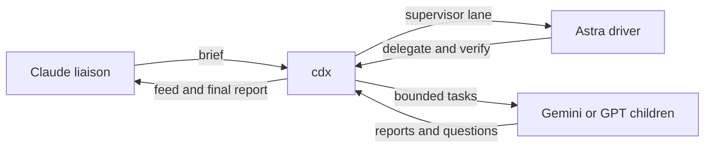

<div align="center">

# cdx 6.1.0

**Codex and Antigravity execution lanes for Claude Code.**

Astra drives. Gemini executes. Liaison reviews and merges. cdx keeps the books.

[](LICENSE)
[](https://bun.sh)
[](cdx.ts)
[](#claude-code-integration)


</div>

cdx is a CLI for [OpenAI Codex](https://github.com/openai/codex) and Google Antigravity lanes. [Claude Code](https://claude.com/claude-code) is the owner's liaison. It briefs an outcome to one Astra supervisor, answers questions, arranges independent review, and merges. Astra owns design and implementation and delegates bounded work to Gemini. cdx records lane state, reports, questions, logs, and token use.

## Setup in 60 seconds

You need [Bun](https://bun.sh) and at least one engine. Install and sign in to [Codex CLI](https://github.com/openai/codex) 0.149+ for `--engine gpt`, or install and authorize Google Antigravity CLI (`agy`) for `--engine gemini`. Then:

```bash
git clone https://github.com/RedesignedRobot/cdx.git ~/.claude/skills/cdx && ln -s ~/.claude/skills/cdx/cdx.ts ~/.local/bin/cdx
```

Install or refresh the Antigravity agent files, then verify the configured engines with live round trips:

```bash
cdx doctor --fix
cdx doctor --probe
```

`doctor` checks engine binaries, login and usage, configuration, plugin hooks, the monitor, and stale ledger entries. For Antigravity it also checks agent files, loaded hooks, and model availability. `--fix` installs the shipped Antigravity agents and hooks and repairs stale rounds. `--probe` runs a short request through each installed engine. Missing `agy` is a warning unless the config enables Gemini.

Every configured Codex home must match the primary home's `AGENTS.md`, complete MCP definitions, and `hooks.json`. Sync removes extra secondary MCP definitions and shared keys absent from primary. The first configured account is primary; without an accounts map, doctor uses `CODEX_HOME` or `~/.codex`. Running `cdx doctor --fix` synchronizes primary `AGENTS.md` directives, shared MCP server definitions and shared config keys in `config.toml`, and `hooks.json` across configured homes while preserving credentials, auth sessions, and account-specific settings.

Cloning into `~/.claude/skills/` loads the plugin in the next Claude Code session. The symlink also makes cdx available as a terminal command.

Works on macOS, Linux, and WSL.

## Browser view

Run `cdx view` in its own terminal, then open `http://127.0.0.1:7477`. Use `cdx view --open` on macOS to open the browser, or `--port N` to choose a port. Ctrl-C stops the server. Journal reads take the event lock without changing stored state.

The page opens on running lanes and jobs. Running, Done, Failed, and All filters remember your choice across reloads. All keeps running work first, then finished work. Each group sorts by recent activity. Failed includes invalid gates; closed and adopted lanes appear only in All. Parent names stay on each row without changing the order. Expand Feed for the latest 200 entries. The dashboard reads discrete `work` and `review` round records directly, without flat state or cwd fallbacks.

Select a lane for its owner, elapsed time, questions, reports, and live transcript. Pick a round to inspect earlier output. Escape closes the details. Logs follow new output until you scroll up.

Violet orbits mark Astra/GPT, teal scanlines mark Gemini, and amber tickers mark jobs. These show running state, not measured progress. A lane with no events for five minutes gets a quiet warning. New rounds enter once; new transcript lines fade in. The page respects reduced motion, works offline, and follows the system light or dark theme. It uses system fonts and no dependencies.

## Two engines

`--engine` is optional on spawn, review, and adopt and defaults to `gemini`. `--engine gpt` is explicit. Resume inherits the lane engine. Gemini always runs `gemini-3.8-flash-high`; cdx ignores `--effort` for Gemini with a note. Gemini has no headless fork, so resume it instead.

`--model M` picks the Codex model for a gpt lane: an alias from the `models` config map (`astra` for `gpt-6-astra`, say) or a raw model id. The lane keeps its model across resume, fork, and review, and status shows it. The built-in `gpt-6-astra` effort cap at `medium` stays.

`--supervisor` lets a GPT lane drive its own children through spawn, resume, review, consult, send, reply, kill, and close. Gemini is the default child engine; GPT children and read-only consults are also available. Astra may use native subagents for bounded work or exploration. It must join them before reporting, but cdx tracks only cdx children.

Limits retained in 5.0:

- Supervisors drive only their own children so they cannot disturb another task. Ending a supervisor round stops running children; reporting with a running child fails the round.
- Nested supervisors are refused to keep delegation one level deep. Native subagents and cdx child lanes are instructed not to delegate further; the Codex depth hook remains in place.
- Child gates cannot change through `gate`, `resume --gate`, or respawn because they define acceptance. Omitting `--gate` on a supervised respawn preserves and runs the stored gate.
- Codex reviews use a read-only sandbox. Gemini reviews fail if the tree changes, so review only a quiet tree.
- Jobs stay with the liaison because they can outlive a lane. Fork, adopt, and clean also stay there because they can affect unrelated history or shared artifacts.
- Lanes are instructed not to commit, push, or deploy because the liaison integrates after review. These controls prevent mistakes; shell access is not a security boundary.

## Quickstart

```bash
# Default path for a whole change
cdx spawn search-fix --engine gpt --model gpt-6-astra --supervisor --bg \
  --cd ~/code/myapp --gate "bun run check" "Fix the search timeout and verify the affected flows."
cdx wait search-fix --report

# A bounded task can go directly to Gemini
cdx spawn fix-flaky-test --engine gemini --cd ~/code/myapp "The test in auth.test.ts fails
intermittently. Find the race, fix it, and add a deterministic regression test."

# Three workers in parallel, detached, each in its own git worktree
cdx spawn api-docs   --engine gemini --cd ~/code/myapp --worktree ~/code/myapp-docs --bg "Document every public endpoint in openapi.yaml."
cdx spawn dead-code  --engine gemini --cd ~/code/myapp --worktree ~/code/myapp-dead --bg "Find and delete unreachable code. List every deletion."
cdx spawn slow-query --engine gpt --cd ~/code/myapp --worktree ~/code/myapp-perf --bg "Profile the /search endpoint and fix the N+1."
cdx wait api-docs dead-code slow-query

# Watch a worker think, live
cdx tail -f slow-query

# Correct a running worker without waiting for the round to finish
cdx send slow-query "The slow path is /search/export, not /search."

# Continue a thread with its context intact
cdx resume dead-code "Also remove the now-unused imports."

# Review a worker's diff in a fresh, read-only session
cdx review slow-query-review --engine gemini --cd ~/code/myapp-perf --uncommitted

# Finish
cdx report slow-query
cdx close slow-query "landed in a1b2c3d"
```

## How it works




- Each lane has discrete `work` and `review` round records. Version 5 writes `{ version: 5, lanes: { ... } }` and `.ledger-version` to reject older writers. The writer migrates 3.x and 4.0 ledgers once on write under lock and rejects legacy shapes thereafter. Flat `state` and `cwd` aliases are removed from the ledger and view summaries. A new round clears its predecessor's report and note.
- The runner handles engine events, qualifies Gemini results, and finalizes reports and gates. Shared JSONL framing handles unterminated responses and skips non-object values. Effort is pinned in the round spec; every round spec requires an explicit engine and effort, and pre-4 effort and account fallbacks are removed. Resuming a live round is refused.
- Usage mutations share one `.usage.lock` transaction so parallel probes preserve each other's account snapshots.
- Detached lanes: Detached lanes keep running after your shell exits.
- One engine child per work round: GPT uses a Codex app-server over stdio. Gemini uses Antigravity stream JSON over stdio and keeps the conversation ID for resume.
- Reports captured per round: Both GPT and Gemini work reports capture the final agent message of the turn, not concatenated turn text. Non-success Gemini results write `reports/<lane>-r<n>.partial.md` and never overwrite full reports.
- Auto-continue: A Gemini round reporting a transport error (`The stream was interrupted` or `timeout waiting for response`) while agy is alive gets up to two continuation turns in the same conversation. The feed line reports `auto-continue <n>/2`. Status reports `auto-continued <n>x`. A third failure fails the round with note `turn failed after 2 auto-continues: <reason>`.
- Five-hour quota guard: A Gemini round ending with `Individual quota reached` writes `~/.cdx/gemini-quota.json` with the parsed reset time (30 minutes when unparsed). `spawn`, `resume`, and `review` refuse Gemini work until it passes and point at `--engine gpt`. Every Gemini round refreshes `usage-gemini.json`; a fresh snapshot blocks under 5% five-hour remaining and warns under 15%. Status, brief, and doctor show the block.
- Replayed-error detection: Antigravity can return the previous turn's error verbatim on a resumed conversation even though the new turn finished. When the error equals the lane's last recorded error and the turn produced a final agent message, the round finalizes as success with feed line `ignored replayed agy error: <text>`. Transport errors stay on the auto-continue path.
- Strict report contract: A completed work turn needs a qualifying report. Without one, the round fails with `no final report`, and cdx skips the acceptance gate. A Gemini round whose final response is the agy cancellation template ("User initiated cancellation", "Execution stopped per your cancellation request") finalizes failed with note "agy returned its cancellation template as the report; no qualifying report", and the gate does not run.
- Reviews run in fresh sessions: Codex enforces a read-only sandbox. Gemini reviews return structured output via JSON schema into `reports/<lane>-r<n>.findings.json`. cdx compares the tree before and after the round and fails if any file changed.
- Stall detection: A lane quiet for five minutes writes a feed warning, repeated at most every ten minutes, with an active-again line when events resume.

## Commands

| Command | What it does |
|---|---|
| `cdx spawn <lane> [--engine gpt\|gemini] [--model M] [--supervisor] "<brief>"` | Start a worker in its own lane |
| `cdx resume <lane> "<follow-up>"` | Continue a lane's thread, context intact |
| `cdx gate <lane> "<cmd>"` | Set or replace an inactive lane's acceptance gate |
| `cdx fork <new> <lane> "<brief>"` | Branch a thread into a new lane |
| `cdx send <lane> "<text>"` | Deliver in-turn steers via hooks or queue follow-up turns |
| `cdx ask "<question>"` | Ask the owning liaison from inside a work lane and wait for its answer |
| `cdx reply <lane> "<answer>"` | Answer the oldest open question from the lane's current round, or select one with `--id` |
| `cdx questions [lane]` | List current-round open questions across all lanes or one lane |
| `cdx msg <target> "<text>"` | Send a feed message to a full session id or a lane's owning session |
| `cdx inbox` | Print messages addressed to the calling Claude session |
| `cdx review <lane> [--engine gpt\|gemini]` | Review a lane's diff in a fresh session |
| `cdx status` | Show lane state, timing, tokens, steer count, open question, and last activity |
| `cdx usage` | Codex account limits, which account to spend next and why, Gemini limits, and all-time ledger totals |
| `cdx wait <lane\|job>...` | Block until lanes or jobs finish; exit 1 if any failed; `--report` prints the reports too |
| `cdx job <name> "<cmd>"` | Run a shell command detached: one log, one feed line on exit; `wait`, `kill`, and `status` know it |
| `cdx tail <lane>` / `cdx tail -f` | Rendered event log, or live transcripts of every running lane |
| `cdx feed` | Replay recent completion and stall lines from the feed |
| `cdx report <lane>` | Print a lane's final report |
| `cdx kill <lane>` | Stop a running lane: SIGTERM the runner, force-finalize if it hangs |
| `cdx doctor --probe` | Health check with remedies, hooks and model checks, and live engine round-trips |
| `cdx adopt <lane> <sessionId> [--engine gpt\|gemini]` | Record an existing session as a lane |
| `cdx close` · `cdx clean` · `cdx log [--transcript]` · `cdx brief` | Bookkeeping |

<details>
<summary><b>Full flag reference</b></summary>

```
cdx spawn  <lane> [--engine gpt|gemini] [--model M] [--supervisor] [--account NAME] [--effort E] [--cd D] [--worktree P] [--bg] [--add-dir D]... [--schema F] [--image F]... [--gate "<cmd>"] [--gate-baseline-check] [--max-runtime MIN] "<brief>"
cdx resume <lane> [--effort E] [--bg] [--gate "<cmd>"] [--max-runtime MIN] "<follow-up>"
cdx gate   <lane> ("<cmd>" | --clear)
cdx fork   <new> <lane|sessionId> [--model M] [--account NAME] [--effort E] [--bg] "<brief>"
cdx send   <lane> "<text>"
cdx ask    [--timeout MIN] "<question>"
cdx reply  <lane> [--id SEQ] "<answer>"
cdx questions [lane]
cdx msg    <lane|full-session-id> "<text>"
cdx inbox  [-n N]
cdx takeover <lane|full-session-id>
cdx watch                  # plugin monitor, no arguments
cdx review <lane> [--engine gpt|gemini] [--model M] [--account NAME] [--effort E] [--cd D] [--bg] [--uncommitted | --base B | --commit SHA] [--scope "<files>"] ["<intent>"]
cdx consult <lane> [--model M] [--account NAME] [--effort E] [--cd D] [--bg] "<question>"
cdx adopt  <lane> <sessionId> [--engine gpt|gemini] [--model M] [--account NAME] [--cd D]
cdx view [--port N] [--open]
cdx status [--all] [--json]
cdx usage  [--json]
cdx wait   <lane>... [--timeout S] [--json] [--report]
cdx tail   <lane> [-n N]
cdx tail   -f [lane]
cdx feed   [-n N]
cdx report <lane> [round]
cdx log    <lane> [round] [--transcript]
cdx kill   <lane> ["note"]
cdx close  <lane> [--remove-worktree] ["note"]
cdx clean  [--days N]
cdx doctor [--fix] [--probe]
cdx brief
```

`review` with a target flag (`--uncommitted`, `--base`, `--commit`) reviews that diff. GPT uses Codex's native reviewer. Gemini receives the equivalent `git diff` instruction. An intent review uses the same adversarial review frame on either engine. A Gemini review of a Gemini lane prints a note asking for explicit attack items. Gemini reviews return structured output through a JSON schema; the report field becomes `reports/<lane>-r<n>.md` and findings land in `reports/<lane>-r<n>.findings.json`. GPT reviews keep the closing fenced JSON findings block, which cdx extracts into `reports/<lane>-r<n>.findings.json`. Both engines start a fresh session. Codex enforces read-only access. For Gemini, `cdx hook pre-tool` denies file-writing tools inside review lanes, and cdx records the tree before launch and fails the round with the first changed path if the reviewer writes anything. The report remains available.

GPT work rounds own one `codex app-server` child. cdx starts it with approval policy `never` and full workspace access. Gemini work rounds own one `agy` child with stream JSON input and output, `gemini-3.8-flash-high`, the configured `cdx-lane` agent, and every lane directory passed through `--add-dir`. cdx removes `CODEX_HOME` from the Gemini environment. It stores the Antigravity `conversation_id` as the lane session ID and passes it through `--conversation` on resume. Each engine writes its raw events to the round JSONL log and stderr to a separate log. `--schema` reaches either engine. `--image` is GPT-only. Gemini always runs `gemini-3.8-flash-high` and `--effort` does not change its effort. Every tool is available to Gemini lanes because the shipped `cdx-lane` agent file sets no tools allowlist and cdx passes `--dangerously-skip-permissions`. cdx pins the Gemini model and agent name into the round spec at launch, so the detached runner (which starts without the config file) runs what the liaison configured. The brief rules are described under Configuration. Plain workers cannot drive other lanes. A GPT supervisor can drive its own children and cannot create another supervisor.

When a round fails, cdx writes the engine error to the lane note and completion feed line.

### Communication channels

`cdx send <lane> "<text>"` appends a control record with the text, send time, and optional sender session id. GPT steers the active turn when possible and starts a follow-up turn otherwise. `cdx doctor --fix` installs a `cdx` entry into `~/.gemini/config/hooks.json` with PreToolUse and PreInvocation commands. `cdx hook pre-invocation` delivers pending `cdx send` records into the running turn (feed line `steer delivered mode=in-turn`). Without the hook entry, Gemini sends fall back to follow-up turns (`mode=follow-up-turn`). cdx never consumes a control record before delivery. `send` refuses review lanes.

A worker can run `cdx ask [--timeout MIN] "<question>"`. The runner exports `CDX_LANE`, `CDX_ROUND`, and `CDX_OWNER` to both engines, so `ask` can identify its lane and owner. Brief and liaison replies govern project and skill guidance within runtime constraints; if paused, workers identify the exact conflicting instruction. Workers make reasonable assumptions for reversible work, and ask through `cdx ask` only for missing decisions about outcome or authorization. The command writes `$CDX_HOME/questions/<lane>-r<round>-<seq>.json` with the question, ask time, and `answered: false`. It posts a `QUESTION` line with the lane owner's full session id and polls for an answer. The default and maximum timeout is 30 minutes. A larger value is clamped to 30 and prints a note. `cdx reply <lane> "<answer>"` answers the oldest open question in the lane's current round by default. Add `--id <seq>` to select a specific question. `cdx questions [lane]` lists open questions only from each lane's current round. Round completion and failure close every remaining question from that round with `expired: round ended`, so a later reply cannot match it by default. While a question remains open, `cdx status` shows `waiting on question #<seq>`. On timeout, `ask` exits 0. Timeout is not approval; the worker reports the unresolved dependency and stops only the work that depends on it, continuing independent authorized work without guessing. A timed-out question does not fail the round.

Claude sessions can run `cdx msg <lane|full-session-id> "<text>"`. A lane resolves to its owning head through the persisted takeover binding. Recipient and sender ids are stored as fields in a structured event. Message text never determines routing. Eight-character addresses are rejected. `cdx inbox [-n N]` prints only messages addressed to the caller, newest last, with a default of 20. `msg`, `send`, `ask`, and `reply` replace CR and LF with spaces before writing records.

`spawn --gate "<cmd>"` stores an acceptance gate on the lane. After a work round exits 0 with a report, cdx runs the command with `/bin/sh -lc` in the lane cwd. Exit 0 appends a `## Gate` section to the report. A nonzero exit fails the round with `gate failed (exit N)`. Work resumes rerun the stored gate. Reviews never run one. The gate is the harness's own verification, so a worker's optimistic done claim cannot finalize green.

When a work round changes no files, the gate still decides: cdx runs it as usual, the report gains a "## Harness note" saying no files changed, the feed line carries `diff=empty`, and status shows "no tree change". An unchanged tree is evidence for the liaison, not a verdict; a verification-only resume or a supervisor whose children worked in their own worktrees legitimately changes nothing.

Only `--gate-baseline-check` runs the gate on the untouched baseline tree before worker startup, including worktrees. Worktree spawns do not run baseline checks by default. A baseline failure stops the round as `gate-invalid` and identifies the gate command as the defect. A final gate failure that had no baseline check suggests `--gate-baseline-check` for the next run.

`cdx gate <lane> "<cmd>"` sets or replaces the stored gate. `cdx gate <lane> --clear` removes it. Both forms print the old and new value and refuse to change an active lane. A supervisor cannot change a child's gate through `cdx gate`, `resume --gate`, or `spawn`; the gate is the liaison's acceptance check. Omitting `--gate` on a supervised respawn preserves the existing gate. `resume --gate "<cmd>"` replaces the stored gate before that work round and keeps it for later resumes.

`resume` inherits the lane engine and rejects `--engine`. It reattaches to the recorded work session even after a review. Calling `cdx resume` on an active running lane is refused by the harness; wait for the active round to settle before resuming. A GPT lane prefers its recorded account while eligible. If admission selects another home, cdx starts a fresh session with the task and prior evidence. A Gemini lane resumes with `agy --conversation <sessionId>`. One-time migration assigns GPT to older rows with no engine.

`fork` inherits the source lane engine and model. GPT can fork a lane or a raw Codex session ID; a raw-session fork takes `--model` and applies it to the forked thread's turns. Gemini has no headless fork, so `cdx fork` refuses a Gemini lane and directs the caller to `cdx resume`.

`status` reports the lane outcome and directory from its work record. A review does not replace work outcome. When a lane has review history, `status` prints the review outcome on a separate review line. `status --json` emits a name-to-record map.

`kill` sends SIGTERM to the runner, which reaps its engine child and finalizes the round with a signal note. A runner still silent after 10 seconds gets SIGKILL, and cdx finalizes the ledger with note `killed`. `--max-runtime MIN` uses the same signal sequence on either engine child.

`close --remove-worktree` removes the lane worktree and deletes its branch only when the branch is merged into the repo's HEAD and the worktree is clean; otherwise it refuses with the reason and prints the manual commands.

A brief of `-` reads the brief from stdin (`cdx spawn big-task --engine gemini --bg - < brief.md`), so long prompts with quotes and backticks never fight the shell. Works for spawn, resume, fork, and the review intent. Headless agy expands `/skill-name ...` at the start of a prompt, so a brief may open with a project skill invocation such as `/hyperscale-change ...` when the workspace ships that skill under `.agents/skills`.

`spawn --worktree <path>` creates a git worktree at that path on a new branch `lane/<lane>` from the repo at `--cd` (or the current directory), runs the optional `worktreeSetup` command from config inside it, and runs the lane there. A repository may ship an executable `.cdx-worktree-setup` at its root; `spawn --worktree` runs it after the global `worktreeSetup` command and fails the spawn on nonzero exit. The worktree and branch are recorded in the ledger and shown by `status`; `close` prints the removal commands but never deletes anything itself. This gives each parallel worker exclusive files without sharing a dirty tree.

`wait --json` prints one JSON object per finished lane, in completion order: `work` and `review` records, roundState, exit code, tokens, report path, note, session ID.

</details>

## Orchestration patterns

**Single lane, report on completion.** Run `cdx spawn` in the foreground from a background shell. The harness prints a summary line plus the full report at exit, so one notification carries everything.

**Fan-out.** Fire each lane with `--bg` (they detach and survive the shell), then one `cdx wait a b c` blocks until the wave lands. `wait` exits 1 when any lane failed and exits 2 the moment a waited lane asks a question, printing the question and the `cdx reply` to answer it, so neither side idles for the 30-minute ask timeout. Give each lane `--worktree` when they touch the same repo, so no worker sees another's dirty files.

**Watch live.** `cdx tail -f <lane>` streams one worker's transcript and exits with the lane's outcome. `cdx tail -f` shows all running lanes with `[lane]` prefixes and follows new rounds and lanes. Any terminal or agent session can use either form against the shared state, which is how parallel Claude sessions see each other's workers.

**Steer, iterate, or branch.** `send` corrects a running lane via in-turn steering or a follow-up turn. `resume` continues a finished worker with its recorded engine and context. `fork` branches GPT context into a new lane. Gemini has no headless fork.

**Consult when the design is open.** `cdx consult design --model astra "<question>"` runs a read-only Codex lane framed as a senior advisor to the caller (either the Astra driver or the owner's liaison) with full freedom to challenge the premise, scope, and technical direction: ranked recommendation, rejected alternatives, evidence from the tree, and a closing "Decisions for the caller" list. `cdx resume design "<follow-up>"` keeps the conversation going, still read-only. Status shows it as `consult`. A consult lane needs a fresh name and can never be respawned as a work lane, so its resume stays read-only. Skip the consult when the caller already has a settled design; it is a full Astra pass.

**Supervisor tree.** `cdx spawn plan --engine gpt --model astra --supervisor "<brief>"` hands one Codex lane a multi-part change. It briefs the bounded parts to gemini children with `cdx spawn --bg`, waits with `cdx wait --report`, reviews with `cdx review`, and reports once. The liaison sees the children under `parent=plan` in `cdx status` and kills the whole tree with `cdx kill plan`.

## Claude Code integration

cdx 6.1.0 loads as `cdx@skills-dir` in personal scope. In the owner's installation, `~/.claude/skills/cdx` points to `/Users/mas/code/cdx`. No marketplace or extra installation is needed. Changes to `hooks/hooks.json` require `/reload-plugins` or a restart. `/reload-plugins` does not restart a running monitor and Claude Code does not respawn one that exited, so a change to `monitors/monitors.json` or to the watcher code needs a session restart. `SKILL.md` changes are live.

The plugin monitor runs `cdx watch` with no argument. The monitor's own `CLAUDE_CODE_SESSION_ID` is a child session id, not the head's, so the watcher ignores it. It reads `CLAUDE_PID` and looks up the head's session id in the receipt the session hook wrote for that process; `/clear` writes a new receipt and the watcher follows it. It refuses to run without `CLAUDE_PID` and stands by until the receipt exists. No head setup call is needed. A persisted lease allows one live watcher per full session id, tied to that Claude process. A watcher that finds a live lease stands by and takes over when the holder exits, so a reload that starts the new monitor before the old one stops still ends with one watcher resuming the saved wake cursor.

The watcher delivers owned questions, stalls, final work or review results, job exits, and peer messages. A stall produces one event per quiet episode. Gate failure is part of the final lane event. GPT quota failover emits a quiet account update on success and one terminal failure when no alternate remains. Spawn results stay in command output; supervisor child starts and partial report paths arrive through quiet hooks. Partial reports produce at most one event per round.

`SessionStart`, including compact and resume, restores owned lanes, completed work awaiting attention, open questions, and jobs. Completed lanes remain in recovery until closed. `PostToolBatch` and `UserPromptSubmit` deliver quiet events through `hookSpecificOutput.additionalContext`. Hook calls with `agent_id` do nothing. Missing `session_id` is an error. Wake and quiet cursors are separate, so a hook cannot consume a pending monitor notification. The raw Codex guard stays on `PreToolUse`. There is no Stop hook.

`cdx doctor` checks the `cdx@skills-dir` personal path, installed hook set, hooks observed in the current session, and that session's watcher lease. An installed file alone is not proof of a loaded hook. Doctor reports a missing or stale receipt and asks for a reload or restart. Claude runtime delivery still needs an interactive check.

### Ownership and takeover

Full session ids determine ownership. Directories, session titles, and id prefixes do not. `resume`, `send`, `reply`, `gate`, `close`, `kill`, review, and replacement of an existing lane refuse a caller from another head. Supervisors retain the owning head and may mutate only their own children. Inherited `CDX_OWNER=terminal` stays terminal even if the environment also contains a Claude session id.

A new Claude session must explicitly run `cdx takeover <lane|full-session-id>` before driving another head's work. A lane target claims that lane and its existing supervisor children, whether they were terminal-owned or owned by another head; future children inherit the claim, and the previous owner keeps everything else. A session target moves that head's whole group, including jobs and peer messages, through a persisted binding that redirects already-running producers without changing their saved specs. The previous head then loses mutation authority and delivery. Reusing the same full session id reconnects without takeover. A fork or a new session never claims work automatically. Terminal jobs cannot be claimed by lane.

Takeover replays no history. It sets the caller's delivery cursors to the latest event and prints the owned summary: lanes awaiting attention, open questions, and jobs. `cdx feed` and `cdx inbox` show earlier scoped events on demand. `cdx adopt` still imports an engine session; adopting over an existing lane needs ownership of that lane like any other mutation.

`brief`, `questions`, `feed`, `inbox`, and running-job summaries are scoped to the caller. An ordinary terminal sees terminal-owned work through those readers. The explicit dashboard and status remain shared diagnostic views.

### Journal migration and rollout

`feed.log` now contains JSON records with monotonic ids, timestamps, event kinds, full owner or recipient ids, lane and round or job identity, and message text. Old free-text lines are ignored by every reader and removed by `cdx clean`. They are not guessed into ownership. `sessions.json` stores the sequence, takeover bindings, leases, and delivery cursors. Journal append, cursor updates, and cleanup use the same event lock. Cleanup keeps the latest 2000 records plus records pending for connected sessions. An inactive session can therefore retain older records.

Cursor acknowledgement follows stdout emission. A crash between those steps can replay an event; Claude provides no durable receipt for the final delivery. Compaction recovery reads the ledger and open questions even if a notification was already emitted.

Before rollout, stop old cdx writers and cancel every old global-tail monitor or restart those Claude sessions. Existing monitors retain their old commands and can broadcast the new journal records. Reload the plugin or start fresh sessions after updating. Do not mix version 5 and version 6 runners. The lane ledger remains version 5; the breaking changes are feed format, routing, and mutation ownership.

The liaison should verify two real Claude terminals after reload. Each should show its own live lease in `cdx doctor`. Start work in each, leave one head idle, and have its worker ask a question. Only that head should receive it. Finish one lane, compact its head, and confirm recovery includes the report and any open questions. Verify a foreign mutation fails, then explicitly take over and confirm future events move to the new head.

## Configuration

Everything lives under `$CDX_HOME`, default `~/.cdx`. The optional `$CDX_HOME/config.json`:

```json
{
  "model": "gpt-6-astra",
  "models": { "astra": "gpt-6-astra" },
  "efforts": ["low", "medium"],
  "defaultEffort": "medium",
  "effortCaps": { "gpt-6-astra": "medium" },
  "rules": [],
  "worktreeSetup": "bun install",
  "gemini": {
    "model": "gemini-3.8-flash-high",
    "agent": "cdx-lane",
    "reviewAgent": "cdx-review"
  }
}
```

That is a working example, not the built-in defaults. Without a config file cdx uses model `gpt-6-astra`, efforts `low`, `medium`, `high` with `medium` as the default, the Astra cap below, no aliases (so `--model astra` needs the `models` entry above), no rules, and the Gemini values shown.

- Existing top-level keys configure GPT. `model` is the default Codex model. `models` maps `--model` aliases to model ids (optional; a raw id always works). `efforts` is the GPT `--effort` allowlist. `defaultEffort` applies when the flag is absent.
- `effortCaps` maps a Codex model id to the highest effort it may run at, checked on spawn, resume, fork, review, consult, and the doctor probe after alias resolution. The built-in value caps `gpt-6-astra` at `medium`, so Astra runs `low` or `medium` only; an explicit `--effort high` or `xhigh` fails with the allowed list. Any other source above the cap (the config `defaultEffort`, a lane recorded before the cap, a Gemini review round that stored `high` on a gpt lane) clamps to the cap with a note, and the clamped value travels with every turn, including `codex exec resume` of a review-only session. Config may add caps for other models or lower a built-in cap; raising `gpt-6-astra` above `medium` is a config error. `efforts` must stay within `minimal`, `low`, `medium`, `high`, `xhigh`.
- `gemini` is optional. Its shown values are the defaults. cdx pins the model and agent into each round spec at launch. Gemini always records effort `high`; its effort is not configurable.
- `rules` entries are appended to every injected brief, followed by `.cdx-rules.md` from the lane's working directory when that file exists. This is where house style, tooling mandates, and per-project law live.
- `worktreeSetup` (optional) is a shell command run inside every new `--worktree` before the lane starts, typically a dependency install. A nonzero exit aborts the spawn and leaves the worktree in place for inspection. A repository may ship an executable `.cdx-worktree-setup` at its root; `spawn --worktree` runs it after the global `worktreeSetup` command and fails the spawn on nonzero exit.

### Accounts: earliest reset first, with headroom

Each account needs its own Codex home. cdx sets `CODEX_HOME` for each Codex process so login data and session files stay tied to that account. Log a new home in with `CODEX_HOME=~/.codex-3 codex login`, then add it here.

```json
{
  "accounts": {
    "codex-1": "~/.codex",
    "codex-2": "~/.codex-2",
    "codex-3": "~/.codex-3"
  }
}
```

With an accounts map, `cdx usage` and launch admission share one decision:

1. Work needs 15% remaining weekly capacity and supervisors need 25%. Light turns prefer 5% but may use lower capacity; exhausted accounts are refused for every tier. Choose the earliest reset, then the fuller account when resets tie.
2. Active rounds hold fixed demand against their assigned account during execution: light holds 5%, work holds 15%, and supervisors hold 25%. Admission subtracts active holds before evaluating remaining headroom.
3. Dead runner release: admission reconciles crashed runners and releases their holds while preserving live child holds.
4. Consuming round completion invalidates the account usage snapshot, forcing fresh probes on subsequent rounds.
5. `--account NAME` obeys exhaustion eligibility instead of forcing a depleted account. If the specified account is exhausted or lacks required headroom, admission rejects the launch.
6. Automatic GPT quota failover recovers exhausted accounts across work, review, and consult rounds. When Codex hits quota exhaustion, the runner marks the account exhausted with its reset time and starts a fresh round on an eligible alternate account. The recovery prompt transfers the original brief, round history, and latest report or partial report. If no alternate account is eligible, the lane fails with reset details.

Snapshot thresholds and demand holds guide placement and concurrency control. They do not guarantee full completion within quota, and there is no guarantee unknown capacity will finish.

Usage readings cache for 30 minutes unless a window has reset or the reading lacks per-window data. Failed probes cache for 5 minutes. A failed probe with no usable reading leaves capacity unknown. Exhaustion in any live window rules out an account, even when its weekly window has room.

`usage --json` includes `advice.picks` and account `remainingPercent`, reset times, and reasons. Text output also shows the daily pace that would spend the remaining weekly share before reset.

A GPT review of a Gemini lane selects an account when it has no affinity. A Gemini review preserves the GPT work account. Gemini work rejects `--account`. Tracked lane forks can start a fresh session on another eligible home. Raw-session forks require the source home from `--account` or the primary home to be eligible because cdx has no saved brief or reports for that session. Adopts record `--account` or the primary home without consuming quota. Incomplete account records fail explicitly; migrated rows without affinity pass admission.

Shared config keys are `model`, `personality`, `service_tier`, `model_reasoning_effort`, `features`, `agents`, and `mcp_servers`. Sync preserves unshared values but may reformat TOML. It refuses malformed TOML, inline MCP credentials, and hardcoded MCP `env.CODEX_HOME`. Store HTTP credentials through `env_http_headers` or `bearer_token_env_var`; doctor checks that referenced variables are set without printing values. cdx passes its environment to the selected account process.

Stop older cdx runners before the first 5.0 write; mixed-version ledger writers are unsupported.

Keep each account name tied to one home. Use a new name when a home path changes so its cached usage cannot belong to the previous login.

Do not swap authentication files inside one Codex home while parallel lanes run. A lane can then resume a session under the wrong login.

If `config.json` is absent, the defaults above apply. Malformed JSON or an inconsistent shape stops the command with a message that names the file.

> [!IMPORTANT]
> Work lanes can edit files and run shell commands without approval. The injected brief forbids commits, pushes, deploys, and extra servers. Codex review lanes use a read-only sandbox. Gemini review lanes are enforced by before-and-after tree checks. Point cdx only at code you would let either engine edit.

<details>
<summary><b>What the harness injects</b></summary>

cdx injects the role, report contract, and engine rules, followed by `config.json` rules and `.cdx-rules.md`. Astra resolves routine choices, follows steering, and carries authorized work through verification. It may delegate useful bounded work or exploration. Gemini executes a precise assignment without further delegation.

The brief and liaison replies outrank project and skill guidance within runtime constraints. A blocking instruction must be named and quoted. Questions are for missing decisions that affect outcome or authorization; timeout is not approval. Workers continue independent work and report unresolved dependencies.

Reports name the outcome, changed files, and remaining risks. The test suite runs once per lane, as the gate after the report; workers, supervisors, and reviewers do not run it. Remove duplicated and implementation-mirroring tests.

Each engine handles its own context. cdx does not set a fixed context size.

</details>

<details>
<summary><b>State layout</b></summary>

```
$CDX_HOME/
  ledger.json    version 5 envelope with lanes, work/review records, sessions, tokens, and account holds
  .ledger-version rejects older writers after the first migration
  logs/          raw engine events and stderr for each round
  reports/       final report per round
  briefs/        audit trail of every injected prompt
  specs/         the runner inputs recorded for each round
  control/       queued steering records, one JSONL file per round
  questions/     worker questions and their answer or timeout state
  feed.log       structured lane events and peer messages
  sessions.json  ownership bindings, watcher leases, delivery cursors, and event sequence
```

Everything is plain files. `cdx feed` and `cdx inbox` render scoped events. `cdx clean` retains the latest 2000 records and undelivered records for connected sessions.

</details>

## Testing

`bun run check` is the acceptance gate for changes to cdx. It builds the CLI, then runs the pure ownership and feed parsing tests in `cdx.test.ts`:

```bash
bun build cdx.ts --target=bun --outfile=/tmp/cdx-check.js && bun test cdx.test.ts
```

The build checks syntax and bundling, not TypeScript types. The tests protect full-session ownership routing and reject malformed feed records without spawning processes, sleeping, using fake engines, or creating temporary homes. Keep the test run within about two seconds.

The owner removed the 135 end-to-end tests after a run took 226 seconds. Process lifecycle, engine integration, watchdogs, question timeouts, gate execution, and browser behavior no longer have automated end-to-end coverage. Do not rebuild that suite. The lane gate runs once after the report; workers and reviewers reuse its result.

## License

[MIT](LICENSE)
