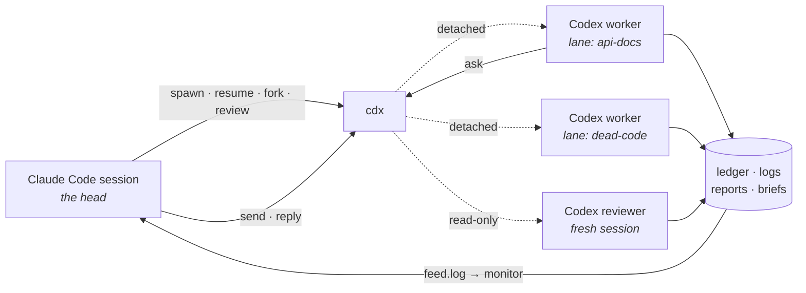

<div align="center">

# cdx

**Codex execution lanes for Claude Code.**

Claude thinks. Codex executes. cdx keeps the books.

[](LICENSE)
[](https://bun.sh)
[](cdx.ts)
[](#claude-code-integration)



</div>

cdx is a single-file CLI that lets a [Claude Code](https://claude.com/claude-code) session drive [OpenAI Codex CLI](https://github.com/openai/codex) workers as parallel, detached background lanes. Claude stays the head: it briefs workers, watches their progress, reviews their output, and integrates the results. Codex does the execution. cdx is the contract between the two.

Running one Codex command from an agent is easy. Running six in parallel, surviving the parent shell, knowing which session ID belongs to which task, steering work in progress, resuming a thread with its context intact, getting the final report, and noticing when a worker died silently is not. cdx owns that bookkeeping in one place.

## Setup in 60 seconds

You need [Bun](https://bun.sh) and [Codex CLI](https://github.com/openai/codex) 0.149+, logged in (`codex login`). Then:

```bash
git clone https://github.com/RedesignedRobot/cdx.git ~/.claude/skills/cdx && ln -s ~/.claude/skills/cdx/cdx.ts ~/.local/bin/cdx
```

Verify the whole chain, including a real Codex round-trip:

```bash
cdx doctor --probe
```

`doctor` checks the binary, login, model, guard, monitor, and ledger, and prints a remedy for anything that fails. With `--probe`, it also starts an app-server, initializes it, starts a temporary read-only thread and turn, collects the reply and token usage, unsubscribes, and closes the child. A closed child or stream fails the probe with its reason instead of leaving the probe waiting. Codex 0.149.1 has no `thread/close` request, so cdx uses `thread/unsubscribe` before closing its owned stdio child. Cloning into `~/.claude/skills/` makes Claude Code load cdx as a plugin automatically in the next session; the symlink makes `cdx` a normal terminal command. Not a Claude Code user? The CLI works standalone, skip the skills directory and clone anywhere.

Works on macOS, Linux, and WSL.

## Quickstart

```bash
# One worker, wait for the report
cdx spawn fix-flaky-test --cd ~/code/myapp "The test in auth.test.ts fails
intermittently. Find the race, fix it, and prove it with 20 green runs."

# Three workers in parallel, detached, each in its own git worktree
cdx spawn api-docs   --cd ~/code/myapp --worktree ~/code/myapp-docs --bg "Document every public endpoint in openapi.yaml."
cdx spawn dead-code  --cd ~/code/myapp --worktree ~/code/myapp-dead --bg "Find and delete unreachable code. List every deletion."
cdx spawn slow-query --cd ~/code/myapp --worktree ~/code/myapp-perf --bg --effort high "Profile the /search endpoint and fix the N+1."
cdx wait api-docs dead-code slow-query

# Watch a worker think, live
cdx tail -f slow-query

# Correct a running worker without waiting for the round to finish
cdx send slow-query "The slow path is /search/export, not /search."

# Continue a thread with its context intact, harder this time
cdx resume dead-code --effort high "Also remove the now-unused imports."

# Review a worker's diff in a fresh, read-only session
cdx review slow-query --uncommitted

# Finish
cdx report slow-query
cdx close slow-query "landed in a1b2c3d"
```

## How it works



- **One ledger entry per lane**: session ID, working directory, state, rounds, token spend, last activity.
- **Detached lanes** keep running after your shell exits.
- **One app-server child per work round**: spawn, resume, and fork use newline-delimited JSON-RPC over stdio. Native and intent-based reviews stay on `codex review` and `codex exec`.
- **Reports captured per round**: a work report comes from the last `agentMessage` with `phase: "final_answer"`, or from an unphased `agentMessage` on an older server. An explicit commentary message never counts. Review reports still come from their one-shot CLI transcript.
- **Strict report contract**: a completed work turn needs a qualifying report. Without one, the round fails with `no final report`, and cdx skips the acceptance gate.
- **Reviews run in fresh sessions** with a sandbox-enforced read-only policy, so the author never grades itself and the reviewer cannot edit.
- **Stall detection**: a lane quiet for five minutes writes a feed warning, repeated at most every ten minutes, with an active-again line when events resume.

## Commands

| Command | What it does |
|---|---|
| `cdx spawn <lane> "<brief>"` | Start a worker in its own lane |
| `cdx resume <lane> "<follow-up>"` | Continue a lane's thread, context intact |
| `cdx gate <lane> "<cmd>"` | Set or replace an inactive lane's acceptance gate |
| `cdx fork <new> <lane> "<brief>"` | Branch a thread into a new lane |
| `cdx send <lane> "<text>"` | Steer a running work turn, or start a follow-up turn if the thread is idle |
| `cdx ask "<question>"` | Ask the owning head from inside a work lane and wait for its answer |
| `cdx reply <lane> "<answer>"` | Answer the oldest open question from the lane's current round, or select one with `--id` |
| `cdx questions [lane]` | List current-round open questions across all lanes or one lane |
| `cdx msg <target> "<text>"` | Send a feed message to a session prefix or a lane's owning session |
| `cdx inbox` | Print messages addressed to the calling Claude session |
| `cdx review <lane>` | Review a lane's diff in a fresh read-only session |
| `cdx status` | Show lane state, timing, tokens, steer count, open question, and last activity |
| `cdx usage` | Per-account plan, rate-limit windows, reset credits, and all-time ledger totals |
| `cdx wait <lane>...` | Block until lanes finish; exit 1 if any failed; `--report` prints the reports too |
| `cdx tail <lane>` / `cdx tail -f` | Rendered event log, or live transcripts of every running lane |
| `cdx feed` | Replay recent completion and stall lines from the feed |
| `cdx report <lane>` | Print a lane's final report |
| `cdx kill <lane>` | Stop a running lane: SIGTERM the runner, force-finalize if it hangs |
| `cdx doctor --probe` | Health check with remedies, plus a live Codex round-trip |
| `cdx adopt` · `cdx close` · `cdx clean` · `cdx log` · `cdx brief` | Bookkeeping |

<details>
<summary><b>Full flag reference</b></summary>

```
cdx spawn  <lane> [--account NAME] [--effort E] [--cd D] [--worktree P] [--bg] [--add-dir D]... [--schema F] [--image F]... [--gate "<cmd>"] [--gate-baseline-check] [--max-runtime MIN] "<brief>"
cdx resume <lane> [--effort E] [--bg] [--gate "<cmd>"] [--max-runtime MIN] "<follow-up>"
cdx gate   <lane> ("<cmd>" | --clear)
cdx fork   <new> <lane|sessionId> [--account NAME] [--effort E] [--bg] "<brief>"
cdx send   <lane> "<text>"
cdx ask    [--timeout MIN] "<question>"
cdx reply  <lane> [--id SEQ] "<answer>"
cdx questions [lane]
cdx msg    <lane|session-prefix> "<text>"
cdx inbox  [-n N]
cdx review <lane> [--account NAME] [--effort E] [--cd D] [--bg] [--uncommitted | --base B | --commit SHA] [--scope "<files>"] ["<intent>"]
cdx adopt  <lane> <sessionId> [--account NAME] [--cd D]
cdx status [--all] [--json]
cdx usage  [--json]
cdx wait   <lane>... [--timeout S] [--json] [--report]
cdx tail   <lane> [-n N]
cdx tail   -f [lane]
cdx feed   [-n N]
cdx report <lane> [round]
cdx log    <lane> [round]
cdx kill   <lane> ["note"]
cdx close  <lane> [--remove-worktree] ["note"]
cdx clean  [--days N]
cdx doctor [--fix] [--probe]
cdx brief
```

`review` with a target flag (`--uncommitted`, `--base`, `--commit`) uses Codex's native reviewer on the diff. `review` with an intent string instead runs an adversarial exec-based review: severity-ranked findings, each marked CONFIRMED or PLAUSIBLE, ending in a fenced json findings block that cdx parses into `reports/<lane>-r<n>.findings.json`. Both are fresh sessions, both sandbox-enforced read-only. Review defaults to the lane's recorded worktree or working directory. `--cd` overrides that directory. The launch output prints the resolved review directory before Codex starts.

Work spawn, resume, and fork rounds each own one `codex app-server` child. cdx initializes the child with experimental API access, then starts, resumes, or forks the thread with `approvalPolicy: "never"` and `sandbox: "danger-full-access"`. Each turn uses `sandboxPolicy: { type: "dangerFullAccess" }`. Spawn sends `config.model`. Resume and fork send no model on either the thread request or `turn/start`, so the stored thread keeps its model. Each notification lands in the round's JSONL log. A report must be the last `agentMessage` with `phase: "final_answer"`, or an unphased `agentMessage` from an older server. Commentary never becomes a report. Once the report and `turn/completed` have both arrived, cdx writes the report before it unsubscribes or stops the child. A later cleanup failure becomes a warning and does not discard the completed round. Work rounds do not use `--output-last-message`. Spawn options map to app-server fields: `--image` adds `localImage` input items, `--schema` sets the turn's `outputSchema`, and `--add-dir` adds writable roots to the thread configuration.

When a turn fails, cdx writes its `turn.error` message or `turn/failed` details to the lane note and the completion feed line.

### Communication channels

`cdx send <lane> "<text>"` appends a record with the text, send time, and optional sender prefix to `$CDX_HOME/control/<lane>-r<round>.jsonl`. The runner checks that file while the round runs. It sends `turn/steer` when a turn is active and starts a new turn when the thread is idle. If the server rejects `turn/steer` because the turn has ended, cdx retains the record and starts a follow-up turn after `turn/completed`. It never consumes a control record before delivery. The feed line records `mode=steered` or `mode=follow-up-turn`. Each successful delivery increments the lane's `steers` count, which `cdx status` shows while the lane runs. `send` refuses review lanes with exit 1 before writing a control record or feed line.

A worker can run `cdx ask [--timeout MIN] "<question>"`. The runner exports `CDX_LANE`, `CDX_ROUND`, and `CDX_OWNER` to every Codex child, so `ask` can identify its lane and owner. The command writes `$CDX_HOME/questions/<lane>-r<round>-<seq>.json` with the question, ask time, and `answered: false`. It posts a `QUESTION` line with the lane owner's suffix and polls for an answer. The default and maximum timeout is 30 minutes. A larger value is clamped to 30 and prints a note. `cdx reply <lane> "<answer>"` answers the oldest open question in the lane's current round by default. Add `--id <seq>` to select a specific question. `cdx questions [lane]` lists open questions only from each lane's current round. Round completion and failure close every remaining question from that round with `expired: round ended`, so a later reply cannot match it by default. While a question remains open, `cdx status` shows `waiting on question #<seq>`. On timeout, `ask` exits 0 and tells the worker to take the conservative reading, record the deviation in its report, and continue. A timed-out question does not fail the round.

Claude sessions can run `cdx msg <target> "<text>"`. A target can be an eight-character session prefix or a lane name, which resolves to that lane's owner. The caller must have `CLAUDE_CODE_SESSION_ID`. cdx writes `[cdx] msg to=<target8> from=<caller8>: <text>` to `feed.log`. cdx replaces CR and LF characters with spaces in `msg`, `send`, `ask`, and `reply` text before any feed or control write. User text cannot inject a second record into either line-based file. `cdx inbox [-n N]` reads only the needed tail and prints messages addressed to the caller, newest last. It defaults to the newest 20 messages.

`spawn --gate "<cmd>"` stores an acceptance gate on the lane. After a work round exits 0 with a report, cdx runs the command with `/bin/sh -lc` in the lane cwd. Exit 0 appends a `## Gate` section to the report. A nonzero exit fails the round with `gate failed (exit N)`. Work resumes rerun the stored gate. Reviews never run one. The gate is the harness's own verification, so a worker's optimistic done claim cannot finalize green.

A worktree spawn with `--gate` runs the gate once in the untouched baseline tree before the worker starts. A non-worktree spawn runs this check when you also pass `--gate-baseline-check`. A baseline failure stops the round as `gate-invalid` and identifies the gate command as the defect. A final gate failure that had no baseline check suggests `--gate-baseline-check` for the next run.

`cdx gate <lane> "<cmd>"` sets or replaces the stored gate. `cdx gate <lane> --clear` removes it. Both forms print the old and new value and refuse to change an active lane. `resume --gate "<cmd>"` replaces the stored gate before that work round and keeps it for later resumes.

`resume` always reattaches to the lane's work thread (`workSessionId` in the ledger), even after review rounds recorded a newer read-only session. Only a lane that never had a work session resumes as a review follow-up.

`status` keeps the lane state and cwd tied to the latest work round. A review does not replace either value. When a lane has review history, `status` prints the review outcome and target directory on a separate review line.

`kill` sends SIGTERM to the runner, which reaps its codex child and finalizes the round with a signal note. A runner still silent after 10 seconds gets SIGKILL, and cdx finalizes the ledger directly with note `killed`. `--max-runtime MIN` uses the same sequence on the app-server child. It sends SIGTERM at the cap, then SIGKILL 10 seconds later if the child remains alive.

`close --remove-worktree` removes the lane worktree and deletes its branch only when the branch is merged into the repo's HEAD and the worktree is clean; otherwise it refuses with the reason and prints the manual commands.

A brief of `-` reads the brief from stdin (`cdx spawn big-task --bg - < brief.md`), so long prompts with quotes and backticks never fight the shell. Works for spawn, resume, fork, and the review intent.

`spawn --worktree <path>` creates a git worktree at that path on a new branch `lane/<lane>` from the repo at `--cd` (or the current directory), runs the optional `worktreeSetup` command from config inside it, and runs the lane there. The worktree and branch are recorded in the ledger and shown by `status`; `close` prints the removal commands but never deletes anything itself. This gives each parallel worker exclusive files without sharing a dirty tree.

`wait --json` prints one JSON object per finished lane, in completion order: state, exit code, tokens, report path, note, session ID.

</details>

## Orchestration patterns

**Single lane, report on completion.** Run `cdx spawn` in the foreground from a background shell. The harness prints a summary line plus the full report at exit, so one notification carries everything.

**Fan-out.** Fire each lane with `--bg` (they detach and survive the shell), then one `cdx wait a b c` blocks until the wave lands. Give each lane `--worktree` when they touch the same repo, so no worker sees another's dirty files.

**Watch live.** `cdx tail -f <lane>` streams one worker's transcript and exits with the lane's outcome. `cdx tail -f` shows all running lanes with `[lane]` prefixes and follows new rounds and lanes. Any terminal or agent session can use either form against the shared state, which is how parallel Claude sessions see each other's workers.

**Steer, iterate, or branch.** `send` corrects a running lane. `resume` continues a finished worker with everything it already knows. `fork` branches that knowledge into a new lane when you want two directions explored from the same starting point.

## Claude Code integration

Installed as a plugin (the clone into `~/.claude/skills/` above), cdx wires itself into the session:

- **No polling.** Lane events and messages append to `$HOME/.cdx/feed.log`; a monitor tails it and Claude Code surfaces new lines as notifications.
- **Session attribution.** Every lane feed event ends with `owner=<session prefix>`, so parallel Claude Code sessions can identify which lane events belong to them.
- **Peer messages.** `cdx msg` addresses a feed line to one session prefix. A matching `msg to=` line is a request from that peer. Other targets remain visible as shared feed information.
- **Session opener.** A SessionStart hook runs `cdx brief`, which prints only running or failed lanes and stays silent when everything is settled.
- **Guard rail.** A PreToolUse hook blocks raw `codex exec` / `review` / `resume` / `fork` invocations and points the caller to `cdx`, so all Codex work flows through the ledger. Quoted mentions, `codex login`, and version checks pass through.
- **`/cdx` skill.** The playbook that teaches the session the commands and patterns above.

## Configuration

Everything lives under `$CDX_HOME`, default `~/.cdx`. The optional `$CDX_HOME/config.json`:

```json
{
  "model": "gpt-5.6-sol",
  "efforts": ["low", "medium", "high"],
  "defaultEffort": "medium",
  "rules": [],
  "worktreeSetup": "bun install"
}
```

- `model` is passed to the app-server when a work lane spawns and when a doctor probe creates its temporary thread. Resume and fork omit it so the stored thread keeps its model. Reviews pass it to the Codex CLI.
- `efforts` is the allowlist for `--effort`; cdx rejects anything else and names the config file in the error.
- `defaultEffort` applies when `--effort` is absent. Resume and fork keep the lane's stored effort while it remains allowed; `resume --effort` overrides it for that round onward.
- `rules` entries are appended to every injected brief, followed by `.cdx-rules.md` from the lane's working directory when that file exists. This is where house style, tooling mandates, and per-project law live.
- `worktreeSetup` (optional) is a shell command run inside every new `--worktree` before the lane starts, typically a dependency install. A nonzero exit aborts the spawn and leaves the worktree in place for inspection.

### Two accounts, automatic failover

Each account needs its own Codex home. cdx sets `CODEX_HOME` for every Codex process in a lane, which keeps login data and session files tied to that account.

```json
{
  "accounts": {
    "codex-1": "~/.codex",
    "codex-2": "~/.codex-2"
  }
}
```

The first entry is primary. Spawn and review choose the first account with capacity. Pass `--account codex-2` to force one. Resume and lane-based fork keep the recorded account. Adopt and a raw-session-ID fork use the primary unless `--account` names another account.

Keep each account name tied to one home. Use a new name when a home path changes so its cached usage cannot belong to the previous login.

Do not swap authentication files inside one Codex home while parallel lanes run. A lane can then resume a session under the wrong login.

If `config.json` is absent, the defaults above apply. Malformed JSON or an inconsistent shape stops the command with a message that names the file.

> [!IMPORTANT]
> Work lanes set app-server approval policy `never`, thread sandbox `danger-full-access`, and turn sandbox policy `dangerFullAccess`, so workers can edit and run tests unattended. The injected brief (no commit, no push, no deploy, no extra servers) is the only restriction on those lanes. Review lanes are different: `codex review` and `codex exec` run with sandbox-enforced read-only access and no approval prompts. Point cdx only at code you would let Codex loose on.

<details>
<summary><b>What the harness injects</b></summary>

Every work brief says that workers must not commit, push, deploy, or start extra long-running servers. It includes the report contract and asks workers to use subagent threads when independent work can run in parallel. Review lanes receive a read-only rule and an adversarial review frame. cdx appends `config.json` rules after those built-ins, then appends the lane working directory's `.cdx-rules.md`.

The Codex CLI handles context compaction. cdx does not set a fixed context size or override the CLI's compaction limit.

</details>

<details>
<summary><b>State layout</b></summary>

```
$CDX_HOME/
  ledger.json    one entry per lane: session, state, rounds, tokens, notes
  logs/          JSONL app-server notifications for work; CLI output for reviews
  reports/       final report per round
  briefs/        audit trail of every injected prompt
  specs/         the runner inputs recorded for each round
  control/       queued steering records, one JSONL file per round
  questions/     worker questions and their answer or timeout state
  feed.log       newest lane events and peer messages, tailed by the plugin monitor
```

Everything is plain files. `cat` works on all of it. `cdx feed` and `cdx inbox`
read only the tail needed for their requested output. `cdx clean` truncates
`feed.log` to its newest 2000 lines.

</details>

## License

[MIT](LICENSE)
