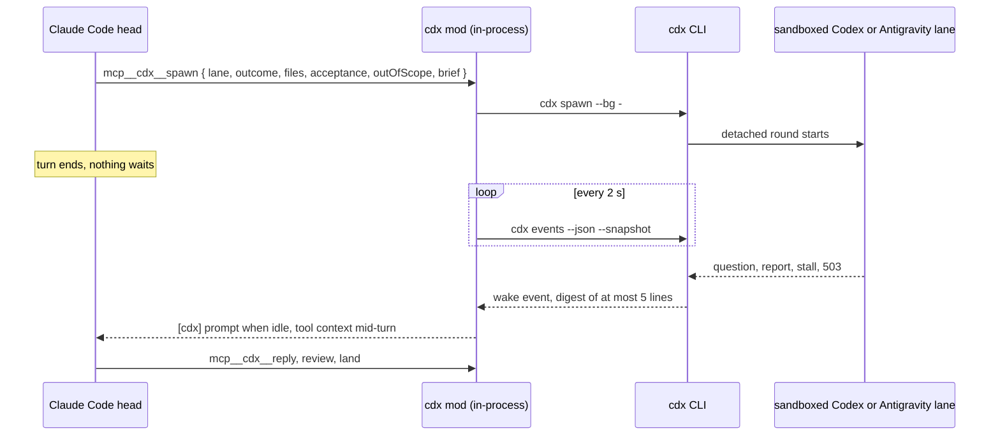

<div align="center">

# cdx 10.0.0

**A native Claude Code plugin that runs OpenAI Codex, Google Antigravity and Claude panel lanes.**

Claude is the head. cdx keeps the books in one SQLite file, sandboxes every lane, and wakes the head when a lane needs it.

[](#native-in-claude-code)
[](#registered-tools)
[](CHANGELOG.md)
[](https://bun.sh)
[](cdx.ts)
[](LICENSE)


</div>

cdx is a [Claude Code](https://claude.com/claude-code) plugin and a standalone CLI for [OpenAI Codex](https://github.com/openai/codex) and Google Antigravity lanes. Claude Code is the owner's liaison: it briefs outcomes, answers questions, arranges independent review, and lands. cdx records lane state, reports, questions, logs and token use, runs each lane's gate, and proves what it lands. `SKILL.md` is the head's playbook; this file is the operator manual.

## Native in Claude Code

cdx runs inside Claude Code as a [function hooks](#claude-code-integration) module. At session start the mod registers tools under `mcp__cdx__`, the `/lanes` command, a live band, a status line, and a two-second poll of the event table. The head spawns a lane with one tool call and ends its turn. cdx wakes the head when the lane finishes, asks a question, stalls, or hits an outage.



| In the session | What it does |
|---|---|
| `mcp__cdx__spawn`, `resume`, `review`, `consult`, `panel` | Start work. The brief travels as a tool field, never through the shell. |
| `mcp__cdx__reply`, `send`, `msg` | Answer a question, steer a running lane, message a session. |
| `mcp__cdx__status`, `events`, `report`, `tail`, `questions`, `inbox`, `usage` | Check in without waiting. |
| `mcp__cdx__land`, `close`, `kill`, `gate`, `gate-receipt`, `job`, `ask`, `doctor` | Land, finish, stop, gate, run detached jobs, ask a code question, diagnose. |
| `[cdx]` prompts and toasts | Wake events arrive as a prompt when the head is idle and as context on the next tool result mid-turn. |
| `/lanes` | Opens a live Pane with lane details and recent transcript lines. Arguments forward to cdx. |
| Live band and status line | Running lanes and jobs, stage, elapsed round time, steps, files and current action, refreshed every two seconds. |

There is no wait tool by design. The CLI keeps `cdx wait` for supervisors and people at a terminal.

## Setup

You need [Bun](https://bun.sh) and at least one engine. Install and sign in to [Codex CLI](https://github.com/openai/codex) 0.156+ for the default `gpt` engine, or install and authorize Google Antigravity CLI (`agy`) for `--engine gemini`. `cdx panel` also needs the `claude` binary and macOS `sandbox-exec`.

```bash
git clone https://github.com/RedesignedRobot/cdx.git ~/.claude/skills/cdx && ln -s ~/.claude/skills/cdx/cdx.ts ~/.local/bin/cdx
cdx doctor --fix
cdx doctor --probe
```

Cloning into `~/.claude/skills/` loads the plugin in the next Claude Code session; the symlink makes cdx a terminal command. Works on macOS, Linux and WSL. The sandbox, `ask` and `panel` need macOS.

`doctor` checks engine binaries, login and usage, configuration, the Codex model catalog, function hooks, mod polling, the state database, stale review snapshots and idle worktrees. It reads `<primary Codex home>/models_cache.json` and fails `codex models` when `model`, `thinkerModel` or an alias target is missing; run `codex update`, then `codex debug models`. For Antigravity it checks agent files, loaded hooks and model availability; missing `agy` is a warning unless the config enables Gemini. `--probe` runs a short request through each installed engine.

`doctor --fix` renders the Codex lane homes, installs the Gemini agents and hooks under `~/.gemini/config/`, removes retired rules from `config.json`, repairs stale rounds, and removes stale snapshots and idle cdx worktrees. Existing engine processes continue unchanged; new rounds use the new homes. Reload the Claude plugin after updating cdx to expose new native tools.

### Upgrading from 9.x

1. Stop every lane and job. A 9.x runner left running writes `ledger.json`, which 10.0 never reads.
2. Install 10.0 and run `cdx doctor --fix`. Remove `visibility.heartbeatMinutes` and `visibility.fileEdits` from `config.json`; 10.0 refuses unknown keys.
3. Run `cdx migrate` once.

`cdx migrate` imports version 5 ledger lanes (closed ones straight into the archive), feed events, jobs and questions into `state/cdx.db` in one transaction, then moves the old files to `state/legacy/` as the backup. It refuses a second run. Lanes already in the database win over the JSON copy. The lifecycle events `started`, `active`, `progress`, `gate-started` and `report-written` are dropped. Nothing migrates on read: until `cdx migrate` runs, `cdx status` prints a hint on stderr and `cdx doctor` warns. A round spec from 9.x lacks the rendered lane instructions and the runner refuses it; give such a lane a fresh round.

## Engines and routing

`--engine` is optional on spawn and review and defaults to `gpt`; omitting it prints `cdx: engine gpt (default)`. Resume inherits the lane engine.

- **Sol direct is the default in every repository.** A new gpt work lane runs `model`, default `gpt-6-sol`. `repoRouting` defaults to `{}`.
- **Astra thinks.** Head-launched review, consult and `--supervisor` lanes run `thinkerModel`, default `gpt-6-astra`. A child lane can never run `gpt-6-astra`; the refusal is checked on the resolved model before any account probe or process start.
- **Gemini is for read-only work**: consults, reviews, pre-reads and crawls. A Gemini work lane prints `cdx: routing reserves Gemini for read-only work (consults, reviews, pre-reads); this work lane runs anyway`. Gemini always runs `gemini-3.8-flash-high` at effort `high`, gets a 90-minute `--max-runtime` unless the flag says otherwise, and warns on briefs over 1,500 words.
- **Claude** runs only panel members and read-only consults. `--engine` on spawn and consult accepts only `gpt` and `gemini`.

`--model M` takes an alias or a raw model id. The built-in aliases are `astra` and `sol`; the `models` config map adds more. A lane keeps its work model across resume. A review round records its model as `reviewModel`; the lane's `model` stays the work model. Before opening a GPT round, cdx checks the resolved model against the selected account's cached model catalog and refuses only when a complete catalog excludes it.

`repoRouting` maps absolute canonical repository paths to work models, for example `{ "/Users/me/code/app": { "model": "gpt-6-astra" } }`. Linked worktrees and subdirectories use the main repository identity. An explicit `--model` or `--engine gemini` wins, a respawn keeps its stored model, and children never receive Astra from a route. Spawn prints the selection reason.

`--supervisor` lets a GPT lane drive its own children through spawn, resume, review, consult, send, reply, kill, close and gate. It needs `## Children` in the brief with two or more child file sets; one file set belongs to a direct Sol lane. Native Codex subagents are disabled in every cdx-launched GPT session (owner ruling 2026-09-12), so every child is a tracked cdx lane with its own cost and gate.

## Quickstart

```bash
# One bounded change: a Sol work lane with the brief contract
cdx spawn search-timeout --cd ~/code/myapp --worktree search-timeout --gate "bun test src/search" --bg - <<'EOF'
## Outcome
Search requests over 2 s return a partial page instead of a 504.
## Files
- src/search/handler.ts
- src/search/handler.test.ts
## Acceptance
handler.test.ts has a case where the index answers after 3 s and the response is 200 with partial=true.
## Out of scope
Index tuning, the export endpoint.
EOF

# A read-only question, no lane
cdx ask --cd ~/code/myapp "Where is the search deadline set?"

# Correct a running lane without waiting for the round to finish
cdx send search-timeout "The deadline lives in config/search.ts, not the handler."

# Review under any name; the proof binds to the tree
cdx review search-timeout-review --cd ~/code/wt/search-timeout --uncommitted

# Land: commit, gate the merge once, fast-forward, push, clean up
cdx land search-timeout

# Several green lanes, one gate and one push
cdx land --batch api-docs dead-code slow-query
```

## The brief contract

A work brief given to `cdx spawn`, a respawn included, must carry four sections and a gate:

| Section | Holds |
|---|---|
| `## Outcome` | What must be true when the lane is done |
| `## Files` | The files the lane owns |
| `## Acceptance` | The assertion that separates success from a plausible wrong answer |
| `## Out of scope` | What the lane must not do or touch |

Any heading level counts and titles match loosely: "Acceptance criteria", "Out-of-scope" and "Non-goals" all count. A section with an empty body does not. The gate comes from `--gate` or the repository's `.cdx-gate`. `--supervisor` also needs `## Children` (or "Child file sets") with two or more list items. Resume, consults and reviews are exempt. The refusal names every missing piece in one line:

```
work brief refused, missing "## Outcome", "## Files", ...; consults and reviews are exempt
```

The MCP `spawn` tool takes `outcome`, `files[]`, `acceptance`, `outOfScope` and `children[]` as fields and renders them as sections ahead of `brief`.

`--scope-policy ask|extend|stop`, default `extend`, is stored on the lane and added to the ground rules at spawn and resume:

- `extend`: the lane edits what the outcome needs and lists each file outside its Files section under `## Scope extensions` in its report. The gate receipt records those items as `scopeExtensions`.
- `stop`: the lane does not edit outside Files; it names the file and the reason in its report and ends the round.
- `ask`: the lane asks the head.

Under extend and stop, a `cdx ask` that reads as a scope-permission question ("may I edit outside my files") gets an immediate answer from cdx. The question is stored as answered and the head is not woken. The classifier is keyword-based.

A no-op gate is refused when the repository has `.cdx-gate`, at spawn and at `cdx gate`: `true`, `:`, `exit`, `exit 0`, `/bin/true`, `/usr/bin/true`, and a bare `echo ...`.

The brief's `Ground rules:` block is a pointer, not a copy: the role's lane home AGENTS.md, `Project rules: read <repo>/.cdx-rules.md` when that file exists, and the [context digest](#context-digest) for HEAD or one of the last 20 commits, with older digests listed as stale. A sample work lane went from 3,291 injected bytes to 156.

## Commands

| Command | What it does |
|---|---|
| `cdx spawn <lane> "<brief>"` | Start a work lane under the brief contract |
| `cdx resume <lane> --fix gate\|review "<instructions>"` | Repair failed evidence at the same HEAD |
| `cdx review <lane>` | Review a diff read-only in a fresh session |
| `cdx consult <lane> "<question>"` | Read-only advisor lane |
| `cdx panel <name> --cd D "<question>"` | Astra, Sol and Claude Fable answer; one merged report |
| `cdx context <repo>` | Build the repo's context digest for HEAD |
| `cdx shots grade <dir> --rubric F` | Grade screenshots; `verdict.json` and failed screens only |
| `cdx land <lane>` / `cdx land --batch <lane>...` | Gate the merge result once, advance the base, push, clean up, close |
| `cdx gate <lane> "<cmd>"` / `--clear` | Set or clear an inactive lane's gate |
| `cdx gate-receipt <lane> [--json]` | Content proof for the latest work round |
| `cdx send <lane> "<text>"` | Steer the active turn, or queue a follow-up turn |
| `cdx ask "<question>"` | Inside a lane: ask the head and wait for the answer |
| `cdx ask --cd /repo "<question>"` | From the head: synchronous read-only Gemini answer, no lane |
| `cdx reply <lane> "<answer>"` / `cdx questions [lane]` | Answer or list open questions |
| `cdx msg <lane\|full-session-id> "<text>"` / `cdx inbox` | Message the head or a session; read messages |
| `cdx events` | Unread actionable events for the calling session |
| `cdx status` | Open lanes with stage, steps, dirty files, timing and last action |
| `cdx wait <lane\|job>...` | Block until lanes or jobs finish (terminals and supervisors only) |
| `cdx job <name> --cd D "<cmd>"` | Detached shell job with one log and an event on exit |
| `cdx usage` | Quota windows, observed burn, projections, account picks, outcome totals |
| `cdx tail`, `cdx report`, `cdx log`, `cdx feed` | Read transcripts, reports, logs and recent events |
| `cdx kill`, `cdx close`, `cdx clean` | Stop, close, prune |
| `cdx doctor`, `cdx migrate`, `cdx brief` | Diagnose, import 9.x state, make this session the head |

<details>
<summary><b>Full flag reference</b></summary>

```
cdx spawn   <lane> [--engine gpt|gemini] [--model M] [--supervisor] [--scope-policy ask|extend|stop] [--account NAME] [--effort E] [--cd D] [--worktree P] [--bg] [--add-dir D]... [--schema F] [--image F]... [--gate CMD] [--pre CMD] [--max-runtime MIN] [--expect MIN] ("<brief>" | -)
cdx resume  <lane> --fix gate|review [--effort E] [--bg] [--max-runtime MIN] [--expect MIN] ("<fix instructions>" | -)
cdx review  <lane> [--engine gpt|gemini] [--model M] [--account NAME] [--effort E] [--cd D] [--bg] [--image F]... [--uncommitted | --base B | --commit SHA] [--scope "<files>"] ["<intent>" | -]
cdx consult <lane> [--engine gpt|gemini] [--supervisor] [--model M] [--account NAME] [--effort E] [--cd D] [--bg] [--image F]... ("<question>" | -)
cdx panel   <name> --cd D [--pack F] [--bg] ("<question>" | -)
cdx context <repo> [--model M]
cdx shots grade <dir> --rubric F [--engine gpt|gemini] [--model M] [--downscale]
cdx land    <lane> | cdx land --batch <lane>...
cdx gate    <lane> ("<cmd>" | --clear)
cdx gate-receipt <lane> [--json]
cdx send    <lane> ("<text>" | -)
cdx ask     [--timeout MIN] "<question>"   # inside a lane
cdx ask     --cd /repo "<question>"        # from the head
cdx reply   <lane> [--id SEQ] ("<answer>" | -)
cdx questions [lane]
cdx msg     <lane|full-session-id> ("<text>" | -)
cdx inbox   [-n N]
cdx events  [--json] [--peek] [--snapshot]
cdx status  [--all] [--json | --brief | --line | --watch [--interval S]]
cdx wait    <lane|job>... [--timeout S] [--json] [--report]
cdx usage   [--json] [--totals] | cdx usage --line
cdx tail    <lane> [-n N] | cdx tail -f [lane]
cdx feed    [-n N]
cdx report  <lane> [round]
cdx log     <lane> [round] [--transcript | --tools]
cdx kill    <lane|job> ["note"]
cdx close   <lane> [--remove-worktree | --keep-worktree] ["note" | -]
cdx job     <name> --cd D ("<cmd>" | -) | cdx job
cdx clean   [--days N]
cdx doctor  [--fix] [--probe] [--days N]
cdx migrate
cdx brief
```

Every command taking free text accepts `-` to read it from stdin: `spawn`, `resume`, `consult`, `review` (intent), `panel`, `send`, `reply`, `msg`, `job` and `close`. An empty stdin fails with the command's usage line. `msg`, `send`, `ask` and `reply` replace CR and LF with spaces. Headless agy expands `/skill-name ...` at the start of a prompt, so a Gemini brief may open with a project skill the workspace ships under `.agents/skills`.

Inside a lane, workers cannot run spawn, resume, review, consult, panel, context, shots, land, kill, close, clean, gate, reply, job or migrate. A supervisor may run spawn, resume, review, consult, panel, kill, close, gate and reply on its own children, and land its children into its own branch.

</details>

## Sandbox

Every lane runs sandboxed. cdx builds the writable roots once and hands them to each engine.

| Role | Writable | Notes |
|---|---|---|
| Codex work lane | lane cwd, each `--add-dir`, /tmp and TMPDIR, `${CDX_HOME}/state`, `${CDX_HOME}/control`, the spill dir `logs/<lane>-r<round>.out` | `workspace-write`, network on, `.git` read-only so lanes cannot commit |
| Codex review, consult, consult supervisor | nothing, /tmp included | commands and network still work |
| Gemini lane | the same roots, plus `~/.gemini/antigravity-cli`, TMPDIR and /dev | agy runs under `sandbox-exec`, without `--dangerously-skip-permissions` |
| Gemini review | state, control and spill dirs, the round's partial report and progress log | Gemini hooks run inside agy and write them |
| Claude panel member | `~/.claude`, `~/.claude.json`, TMPDIR, `/tmp/claude-<uid>` | `sandbox-exec`; tools Read, Grep, Glob, Bash |

Nothing else under `~/.cdx` is writable from a lane: not `config.json`, not hooks, not the cdx source. Head-side `cdx ask` uses the read-only Gemini profile. Gates run outside the sandbox in their snapshot.

Supervisors run from their own Codex home, `<account>/cdx-supervisor`, which holds `rules/cdx.rules` with one exec-policy rule, `prefix_rule(pattern = ["cdx"], decision = "allow")`. Codex runs a matching `cdx ...` call outside the sandbox, because Seatbelt does not nest and each child lane needs its own sandbox. Everything that call writes (specs, briefs, logs, reports, `usage.json`, git state for land) comes from that unsandboxed process. Codex skips the rule for commands with a redirect, `$(...)`, an env assignment or a wildcard, so supervisors call `cdx` plainly and leave git writes to cdx.

### Output caps

Every role gets the caps, reviews and supervisors included. Shell output over 4,096 bytes reaches the model as the first 2 KB and the last 1.5 KB, with a notice naming the total byte count and the spill file under `logs/<lane>-r<round>.out/`. Codex cuts through a PreToolUse hook that cdx trusts at thread start; Gemini through the pre-tool hook's `overwrite` field. Read-only Codex lanes cannot write the spill file and see the head and tail plus a note to narrow the command. Commands that invoke `cdx` are not wrapped.

Lanes have no MCP servers: Codex ignores hook rewrites and per-tool limits for MCP output, so codegraph runs through the shell as `perl -e 'alarm 60; exec @ARGV' codegraph explore "<question>"`. On timeout (exit 142) or failure, lanes fall back to rg and file reads and say so.

All GPT threads disable memories, plugins, apps, the skills catalogue and native subagents. GPT work lanes get `model_auto_compact_token_limit` (default 150000) and `tool_output_token_limit` (default 6000).

## Lane homes and rules

Standing lane rules live in a Codex lane home per role under each account home: `cdx-lane`, `cdx-supervisor`, `cdx-review` and `cdx-review-supervisor`. Each has an AGENTS.md cdx renders at launch, with the owner `rules` from config and the test-run limit included, and shares the account's auth, config and sessions without rewriting the interactive home. Gemini's static rules live in `agents/cdx-lane/agent.md` and `agents/cdx-review/agent.md`; Gemini briefs still inline the owner rules and test-run limit. `cdx doctor` compares the work lane home against the rendered instructions.

The rules give lanes the codegraph-first rule, forbid commits, pushes, deploys and extra servers, and limit a work lane to one typecheck (`vp check --no-fmt` or the equivalent named in `.cdx-rules.md`) and one run of each touched spec. The lane gate owns the suite. The brief and liaison replies outrank project and skill guidance; a lane blocked by a file names its path and quotes the instruction.

## Gates, receipts and landing

### Gates

`spawn --gate "<cmd>"` stores an acceptance gate on the lane. After a work round exits 0 with a report, cdx runs the command with `/bin/sh -lc` in a private snapshot of the lane checkout, with `<cwd>/node_modules/.bin` prepended to PATH. Nonzero fails the round. The first fatal diagnostic sets the cause: typecheck, lint, assertion, architecture, formatter, spec cap, missing spec, stale generated, dirty tree, setup, or tool crash. A red gate sends its last 60 lines into one repair turn in the same conversation; cdx reruns the gate once before publishing the result. Work resumes rerun the stored gate; reviews never run one. When a work round changes no files, the gate still runs, the report gains a `## Harness note`, and the terminal line carries `diff=empty`.

Put the repository's mandatory checks in `.cdx-gate` in the primary checkout, for example `bun run check`. cdx finds that checkout through the shared Git directory, reads the file at spawn and resume, and pins the command in the round spec. Parent rounds run it followed by their lane gate in separate shells; children run only their lane gate. An exact duplicate runs once, and a lane command that starts with the baseline plus ` && ` has that prefix stripped.

`cdx gate <lane> "<cmd>"` sets or replaces the stored gate and `--clear` removes it; both refuse an active lane. A supervisor cannot change a child's gate through `gate`, `resume --gate` or respawn. `spawn --pre "<cmd>"` runs a setup check in the lane cwd before the round opens; nonzero refuses the launch and records nothing.

### Receipts

`cdx gate-receipt <lane> --json` and `mcp__cdx__gate-receipt` return a version 1 envelope with `lane`, work `state`, `workExitCode`, `usable` and `receipt`. The receipt holds `round`, `cwd`, `command`, `exitCode`, `finishedAt`, `head`, `tree`, `valid`, an optional `reason`, `scopeExtensions` from the report, and `sharedTreeLanes` when other running lanes shared the Git working tree at gate start. cdx computes the tree with a temporary index (`read-tree HEAD`, `add --all`, `write-tree`) over tracked and untracked nonignored files and leaves the real index alone. It captures HEAD and tree before and after the gate; a moved fingerprint makes the receipt invalid and names the changed paths. Submodules, embedded repositories and non-Git lanes cannot claim content proof.

### Review proof

Review proof binds to content. A review lane that reviewed a lane's worktree or gated tree attests for it, whatever its name. Land refuses only when the lane was reviewed and the newest review of its current or gated tree has P1/P2 findings, or when it was reviewed but never at those trees. Unreviewed lanes land. `resume --fix review` works after a separately named review.

### Land

`cdx land <lane>` (or `mcp__cdx__land`) needs a managed worktree with a green receipt. It commits the lane checkout, builds the merge with the base in git (`git merge-tree --write-tree` plus `commit-tree`, no checkout needed), and runs the lane gate once on that merge commit in a frozen snapshot. When the merge tree equals the lane's green receipt tree (the base did not move and nobody edited), no gate runs. Head edits after the gate are covered by the merge gate instead of refused.

cdx then advances the base: a fast-forward in whichever checkout holds the base branch, or `update-ref` when none does. A dirty base checkout blocks only when its dirty or untracked files overlap the merge. Push goes to the base branch's upstream; a branch without one, such as a supervisor's lane branch, is not pushed and land says so. Land removes the worktree and branch and closes the lane. It records progress so a failed push or cleanup can be retried, never force-pushes, and leaves merge conflicts for the head. The MCP call waits up to 65 minutes for the gate.

`cdx land --batch <lane>...` (MCP `lanes: [...]`) merges lanes from one repository and base branch in order under one gate and one push. A red batch bisects prefixes with at most log2 N extra gates, lands the green prefix, and names the lane whose merge turned it red. Bisection assumes prefix gates are monotonic.

A supervisor merges green children into its own branch with `cdx land <child>` or `cdx land --batch <child>...` and may not land anywhere else. The head lands the supervisor's lane.

### Worktrees and close

`spawn --worktree <path>` creates a git worktree on branch `lane/<lane>` from the repo at `--cd`; a bare name resolves to `~/code/wt/<name>`. It runs the config `worktreeSetup` command, then the repository's executable `.cdx-worktree-setup` when present; a nonzero exit fails the spawn. A clean existing worktree on the expected branch is reused without setup. A work supervisor spawned without `--worktree` gets one named after the lane, and its children get their own worktree by default, branched from the supervisor's branch.

`cdx close <lane>` removes a clean worktree even when its branch is unmerged, and keeps the branch; it refuses a dirty worktree. `--keep-worktree` (native `keepWorktree: true`) closes without touching the worktree and prints guarded manual cleanup commands. `cdx doctor` lists cdx worktrees idle past `--days N` (default 7): merged ones lose worktree and branch, those of closed or unrecorded lanes lose the worktree and keep an unmerged branch. `--fix` removes them; git refuses dirty trees.

## Reviews, consults and panels

`cdx review <lane>` runs an adversarial review in a fresh read-only session over a private snapshot of the recorded HEAD and dirty tree. A target flag (`--uncommitted`, `--base B`, `--commit SHA`) selects that diff; otherwise the intent does, optionally limited by `--scope`. Both engines return structured findings with severity, file, line and failure mechanism. cdx hashes the review tree before and after the round; a moved hash fails the round with "review tree changed despite the read-only sandbox". A second reviewer for the same tree is refused, re-reviews receive only the fix diff and prior findings, and a P3-only verdict closes the loop. Snapshots symlink ignored entries such as `node_modules`; the sandbox blocks writes through those links. `cdx doctor --fix` removes crash leftovers.

`cdx consult <lane> "<question>"` runs a read-only Astra advisor that may challenge the premise and closes with decisions for the caller. `--engine gemini` makes a Gemini helper, and `--supervisor` lets the consult start owned read-only Gemini helpers only. A consult lane keeps its name for consults; a follow-up uses a fresh consult. `consult` and `review` accept `--image F` on gpt.

### Panel

`cdx panel <name> --cd <repo> [--pack <file>] [--bg] ("<question>" | -)` asks Astra (`gpt-6-astra`), Sol (`gpt-6-sol`) and Claude Fable (`claude-fable-5-1`) the same question as read-only consult lanes `<name>-astra`, `<name>-sol` and `<name>-fable`. Each member gets one frozen prompt with the question, the pack path, and a fixed answer shape: recommendation, claims (`- verified|inferred | path:line or number | claim`), dissent, confidence. `--pack` is copied to `briefs/<name>-pack.md` so every member reads the same text.

- `reports/<name>-<member>.md` holds each raw answer.
- `reports/<name>.md` is the merged report, under 60 lines: coverage, per-member tokens, the three recommendations, dissent, and claims grouped by cited path (3/3, 2/3, 1/3). cdx checks each cited file:line against the repo and marks a line that does not exist with `!`.
- When at least two members answered, one Astra consult (`<name>-verdict`) rules on the contradictions only and appends a `## Verdict` of at most 8 lines.
- One completion line: `[cdx] panel=<name> coverage=3/3|incomplete report=<path> astra: ... | sol: ... | fable: ...`. In the foreground it prints; with `--bg` it reaches the head as a `panel` event, or a calling supervisor's control file. Member events never reach the head, and member lanes are closed and archived when the panel finishes.

cdx refuses a panel from a panel member, a second panel in one supervisor round, a second open panel, question plus pack over 20,000 chars, and a launch when Astra's best light-demand account or the active Claude account's tightest weekly window (`cca status --json`) has under 10% left. When cca gives no answer, cdx warns and skips that check. Each member runs at most 15 minutes; a member that fails or times out leaves the panel `incomplete` with the answers that arrived. The MCP `panel` tool (`name`, `question`, `cd`, optional `pack`) always runs with `--bg`.

The `claude` engine calls the real binary (PATH `claude`, else `~/.local/bin/claude`, never `cca claude`) with `-p --model <m> --effort <e> --output-format json --safe-mode --no-session-persistence --tools Read,Grep,Glob,Bash --permission-mode dontAsk`. Tokens come from `modelUsage`, with cache reads and writes counted in input; the list-price cost shows in the lane's last action. Usage history skips claude rounds.

### Context digest

`cdx context <repo> [--model M]` builds `.cdx/context/<HEAD commit>.md` in the repo's main checkout with one read-only gpt consult (Sol by default; Gemini is refused). The digest holds a repo map, commands, the gate, and rule pointers as `path#anchor`, under 6,000 chars; a longer one is refused and not written. `.cdx/` goes into `.git/info/exclude`. An existing digest for HEAD is reused. Lane briefs point at the digest for HEAD or one of the last 20 commits.

### Screenshot grading

`cdx shots grade <dir> --rubric <file> [--engine gpt|gemini] [--model M] [--downscale]` grades every png or jpg in `<dir>` in sequential consults of at most 8 shots, each on a fresh lane `shots-<dir>-<n>` (Sol by default, images attached for gpt). It writes one `<dir>/verdict.json` (per screen: pass or fail and one line; `reports` lists each batch's report) and prints `failed: ...` and `verdict: <path>`. A screen the grader skips fails, and a failed batch fails its screens. `--downscale` writes 1000 px copies of failed shots to `<dir>/downscaled/` with `sips -Z 1000`. `context` and `shots` are refused inside lanes.

## Questions, steering and messages

A worker runs `cdx ask [--timeout MIN] "<question>"`. The runner exports `CDX_LANE`, `CDX_ROUND` and `CDX_OWNER` so `ask` finds its lane. The question lands in the database, a `question` event wakes the head, and `ask` polls for the answer; the default and maximum timeout is 30 minutes. On timeout `ask` exits 0: the worker reports the unresolved dependency and continues independent work. `cdx reply <lane> "<answer>"` answers the oldest open question of the lane's current round, or `--id <seq>` a specific one. Round completion expires every remaining question of that round. While a question is open, `cdx status` shows `waiting on question #<seq>`.

`cdx send <lane> "<text>"` appends a control record. GPT steers the active turn when possible and starts a follow-up turn otherwise. Gemini receives it through the `cdx hook pre-invocation` entry `doctor --fix` installs in `~/.gemini/config/hooks.json`; without the hook, sends become follow-up turns. `send` refuses review lanes.

`cdx msg <lane> "<text>"` addresses the head; `cdx msg <full-session-id> "<text>"` addresses that session. Eight-character prefixes are rejected. `cdx inbox [-n N]` lists messages to the caller or the head, newest last, default 20.

## Events and delivery

State has one owner. A Claude session is a delivery cursor, not an owner: among the sessions that polled within 30 s, the one that most recently drove cdx (spawn, resume, send, review, consult, reply, land, or `cdx brief --head`) is the head and receives events. With no active driver the longest-running active session is the head, so a teammate, a headless `claude -p` or a second terminal never takes the wakes by starting. Owner events have one cursor that moves only after a head received them, so a change of head never skips one. Other sessions receive only messages addressed to their full session id and can read everything with `cdx feed`. `cdx brief` prints running lanes, the five newest finished lanes awaiting attention, open questions, and recent jobs, and prints nothing when the same text ran within 10 minutes.

`cdx events` returns only kinds the head acts on: question, stalled, terminal, job-exit, message, thrash, overrun, outage and panel. All carry `wake: true`. Events for a supervisor's children go to the supervisor, never to the head. `--peek` leaves the cursor in place; `--json --snapshot` adds the live rows the mod draws.

A terminal event is at most five lines: the verdict line with state, exit, gate exit, report path and counters, then up to four lines of failure evidence or the report head, 200 characters each. The same digest goes into a supervisor's control file. The report body stays on disk. Job exits carry state, exit, verdict and log path.

Round progress (steers delivered or rejected, auto-continues, agy retries, gate start, kill requests, answered questions) goes to `logs/<lane>-r<round>.progress.log`, not the event table. A lane quiet for five minutes emits one `stalled` event. The thrash detector wakes once per round when the same command fails `visibility.failureRepeats` times in a row (default 5), or when test runs pass `visibility.testRuns` (default 3); it reads structured failures and exit codes, never free text. `--expect MIN` on spawn, resume and job sets the expected duration (default: the median of recent matching rounds, at least `expectMinutes`); passing it emits one `overrun` event.

## Status, jobs and wait

`cdx status` reads open lanes only. Each block shows state, round, `started by <session prefix> from <cwd>`, round tool steps, git dirty file count, stage (working, gate with elapsed time, reporting, stalled), last action age, tokens, and review outcome on its own line. Consult lanes show `consult`. `--all` and `--json --all` include the archive. `--brief` prints running lanes and jobs one line each under 100 characters, `--line` renders at most 100 characters for a status slot, and `--watch [--interval S]` re-renders the brief view until Ctrl-C.

`cdx job <name> --cd /abs/repo "<cmd>"` runs a detached shell command with one log and a `job-exit` event. `wait`, `kill` and `status` know jobs. The native job tool requires `cd`.

`cdx wait <lane|job>...` blocks until targets finish, prints each completion as the five-second poll sees it, and with `--report` prints report bodies. It exits 1 when a target failed and 2 the moment a waited lane asks a question. `--json` prints one object per finished lane. Supervisors join children with it; the head never does.

`cdx kill` sends SIGTERM to the runner, which reaps its engine child and finalizes the round; a runner silent after 10 seconds gets SIGKILL. `--max-runtime MIN` uses the same sequence. Killing a supervisor stops its tree.

## Claude Code integration

The mod loads from `~/.claude/skills/cdx`. `hooks/hooks.json` declares `modules: ["./register.ts"]`, and the mod calls the CLI through `$.process.run`. Function hooks are early access; enable them in `~/.claude/settings.json`:

```json
{
  "env": {
    "CLAUDE_CODE_ENABLE_FUNCTION_HOOKS": "1"
  }
}
```

Vendored type definitions in `hooks/types/claude-code.d.ts` name their source version on line 1.

### Registered tools

| Tool | Required | Optional | Description |
|---|---|---|---|
| `mcp__cdx__spawn` | `lane, brief, cd` | `outcome, files, acceptance, outOfScope, children, scopePolicy, engine, model, supervisor, worktree, gate, pre, effort, maxRuntime, expect, account, addDirs, schema, images` | Spawn a work lane. Contract fields render as sections ahead of `brief`, which goes through stdin. |
| `mcp__cdx__resume` | `lane, followUp, fix` | `effort, maxRuntime, expect` | Repair a gate or review failure at the same HEAD. |
| `mcp__cdx__review` | `lane, cd` | `engine, model, effort, uncommitted, base, commit, scope, intent` | Start a read-only review. |
| `mcp__cdx__consult` | `lane, question, cd` | `engine, supervisor, model, effort, account` | Start a read-only consult. |
| `mcp__cdx__panel` | `name, question, cd` | `pack` | Three-model read-only panel, always `--bg`. |
| `mcp__cdx__land` | `lane` or `lanes` | | Land one lane, or a batch under one gate. Waits up to 65 minutes. |
| `mcp__cdx__ask` | `cd, question` | | Synchronous read-only Gemini answer within 90 seconds, no lane. |
| `mcp__cdx__events` | | | Actionable events not yet delivered. |
| `mcp__cdx__send` | `lane, text` | | Steer a running lane. |
| `mcp__cdx__reply` | `lane, answer` | `id` | Answer an open question. |
| `mcp__cdx__questions` | | `lane` | List open questions. |
| `mcp__cdx__status` | | `all, brief` | Lane status. |
| `mcp__cdx__report` | `lane` | | A lane's final report. |
| `mcp__cdx__tail` | `lane` | `lines` | Latest log lines. |
| `mcp__cdx__close` | `lane` | `note, keepWorktree` | Close a lane. |
| `mcp__cdx__kill` | `lane` | | Stop a running lane or job. |
| `mcp__cdx__gate` | `lane` | `cmd, clear` | Set or clear a lane gate. |
| `mcp__cdx__gate-receipt` | `lane` | | Gate proof as JSON. |
| `mcp__cdx__job` | `name, cmd, cd` | `expect` | Detached shell job. |
| `mcp__cdx__msg` | `target, text` | | Message the head or a session. |
| `mcp__cdx__inbox` | | `lines` | Messages to this session or the head. |
| `mcp__cdx__usage` | | `totals, json` | Quota rows, burn, projections, picks, outcome totals. |
| `mcp__cdx__doctor` | | `fix, probe` | Diagnose; 120 second timeout. |

Required fields must be nonempty; a missing value never becomes the string `undefined`. Nonzero exits return tool errors. Native tool output above 20 KB is kept in full under `~/.cdx/logs` and returned as its path with bounded head and tail excerpts. Tool commands run in the session directory, which follows the last shell `cd`; that is why `spawn`, `review`, `consult`, `panel` and `ask` require `cd`.

### Never block

Owner ruling, 2026-09-15: the head never blocks on a lane. The mod denies a Bash call of `cdx wait`, `cdx status --watch`, `cdx tail -f`, a `while`/`until`/`for` loop polling cdx, or a sleep chain polling cdx, the same way it denies raw `codex` and `agy` calls. It also denies a shell `cdx <subcommand>` that has a native tool (owner ruling 2026-09-17). Commands without a tool (brief, clean, feed, log, migrate, context, shots) stay available through Bash.

### Delivery in the session

The mod polls `cdx events --json --snapshot` every 2 seconds. One call returns the session's events and a snapshot of running lanes and jobs for the band, the status line and the `/lanes` Pane. Each new wake event shows an 8-second toast.

- Idle wake: with no turn running and a wake event pending, the mod holds it 15 seconds so a burst costs one prompt, then submits a prompt that starts with `[cdx]`.
- Mid-turn: after each non-subagent tool call that was not denied, pending events are added as context under `[cdx] events`. Typed prompts receive them too.
- Prompt budget: Claude Code refuses a plugin's prompt after 50 in one session. The mod then stops submitting, keeps events for the next tool result or typed prompt, puts each fresh wake in the prompt box as a Tab suggestion, and prefixes the status line with `wakes off`. A new session restores wakes.
- Head rollover: the mod counts compactions of the head's own conversation per session. The first Stop after the second compaction blocks once with: update BATCH.md, push the owner "roll session", end the turn.

In headless mode UI status, toasts and logs are skipped; polling and delivery continue.

### Codegraph hook

`hooks/codegraph-nudge.sh` is the head's codegraph PreToolUse hook; the installed copy lives at `~/.claude/hooks/codegraph-nudge.sh`. In a repository with `.codegraph/` it denies clear source exploration once per turn when no explore ran for that repository. It never blocks when the codegraph binary is missing, the repo is unindexed, or an explore already ran that turn, including a failed or timed-out one. Both engines record `codegraphCalls` and `codeSearchesBeforeGraph` per round, shown in status and terminal events.

### Doctor checks for the mod

`cdx doctor` confirms `~/.claude/skills/cdx` resolves to this repository, `hooks/hooks.json` declares only the module, the calling session polled within 15 seconds, and `CLAUDE_CODE_ENABLE_FUNCTION_HOOKS=1` is set. A stale poll means: set the flag and run `/reload-plugins`.

## Configuration

State lives under `$CDX_HOME`, default `~/.cdx`. `CDX_STATE_HOME` overrides the state root for every command. Only cdx's own runners carry it; lane shells, gates and jobs get the root as `CDX_HOME`, so a lane-side `CDX_HOME=/tmp/x cdx ...` stays in `/tmp/x`. The optional `$CDX_HOME/config.json`:

```json
{
  "model": "gpt-6-sol",
  "thinkerModel": "gpt-6-astra",
  "models": { "astra": "gpt-6-astra", "sol": "gpt-6-sol" },
  "repoRouting": {},
  "efforts": ["low", "medium", "high"],
  "defaultEffort": "medium",
  "effortCaps": { "gpt-6-astra": "medium", "gpt-6-sol": "high" },
  "expectMinutes": 15,
  "rules": [],
  "worktreeSetup": "bun install",
  "gemini": {
    "model": "gemini-3.8-flash-high",
    "agent": "cdx-lane",
    "reviewAgent": "cdx-review",
    "maxRounds": 2,
    "maxRuntimeMins": 90,
    "outageFallbackModel": "gemini-3.8-flash-medium"
  },
  "visibility": {
    "failureRepeats": 5,
    "testRuns": 3
  }
}
```

The values shown are the defaults except `worktreeSetup`, which has none. Unknown keys refuse, and malformed JSON stops the command with a message naming the file; `cdx events` falls back to defaults so delivery continues.

- `model` is the Codex model for work lanes; `thinkerModel` for head-launched review, consult and supervisor lanes. `models` adds `--model` aliases. `efforts` is the allowlist within `minimal`, `low`, `medium`, `high`, `xhigh`, `max`; cdx refuses Codex's `ultra` because it delegates through native subagents.
- `effortCaps` maps a model id to its highest effort, checked after alias resolution on spawn, resume, review, consult and the doctor probe. An explicit effort above the cap fails; an inherited one clamps with a note.
- `repoRouting` maps absolute canonical repository paths to `{ "model": ... }`. Default `{}`.
- `expectMinutes` is the floor of the expected duration for lanes and jobs.
- `rules` are rendered into each lane home's AGENTS.md; the lane's `.cdx-rules.md` follows as a pointer.
- `worktreeSetup` runs inside each new `--worktree` before the lane starts; nonzero aborts the spawn and leaves the worktree for inspection.
- `gemini.maxRounds` caps Gemini work rounds per lane; resume past it fails with `round cap <n> reached for <lane>: close it and spawn a new lane with the failure attached`. `outageFallbackModel` must stay in the gemini-3.8 family; empty disables the fallback round.
- `visibility.failureRepeats` and `visibility.testRuns` must be positive integers.
- `model_auto_compact_token_limit` and `tool_output_token_limit` apply to GPT work lanes only.

### Accounts and admission

Each Codex account needs its own home; cdx sets `CODEX_HOME` per process. Log a home in with `CODEX_HOME=~/.codex-3 codex login`, then add it:

```json
{
  "accounts": {
    "codex-1": "~/.codex",
    "codex-2": "~/.codex-2",
    "codex-3": "~/.codex-3"
  }
}
```

`cdx usage` and launch admission share one decision:

1. Spend the account whose spendable window resets first. Observed exhaustion before reset makes an account light-only. Work and supervisor lanes need their sampled demand cost in every live window, with 3% as the fallback; light lanes need positive capacity. Exhausted accounts take nothing.
2. Active rounds hold 3% against their account; admission subtracts holds first. Crashed runners release their holds.
3. `--account NAME` pins that account under the light rule; the owner spends a named account until the quota error arrives (ruling 2026-09-20).
4. A GPT quota failure fails over to an eligible account in a fresh round carrying the brief, round history and latest report or partial report. Without one, the lane fails with reset details.

Demand sizing uses the median input-plus-output tokens of at least five complete successful GPT rounds of that demand, drawn from open lanes and the 200 newest archived lanes, converted through each window's observed tokens-per-percent. Thresholds guide placement; they do not guarantee completion.

Usage readings cache for 30 minutes unless a window reset; failed probes cache for 5. `usage` prints one row per Codex or Gemini weekly window (account, window, used, left, resets in, burn/h, at reset, empty in, holds), the head's Claude seats from `cca status --json`, and the GPT picks. Burn is the percentage-point increase per hour over the last four hours of readings in `usage-history.json` (capped at 2,048). `--totals` adds token totals and outcome lines per engine role (`sol direct`, `astra supervisor`, `gemini child`, ...) and per repo: lanes, green, landed, count and share green on round 1 and landed, and mean rounds to green, over live and archived work lanes, excluding consults, reviews and running lanes. `usage --json` always carries `outcomes: {byEngine, byRepo}`. `usage --line` prints status-line rows from stored snapshots in about 30 ms.

Reset credits within three days of expiry print a red CRITICAL line in usage, doctor and every GPT launch. Redeem through that home's codex TUI `/usage`; cdx cannot. Keep each account name tied to one home, and never swap auth files inside a home while lanes run.

### Gemini

Gemini retries a transport failure once and 503 capacity errors through a six-step backoff, then may run one fallback round on `outageFallbackModel`. Quota refusals and cancellations do not retry. Every Gemini launch prints the time in Riyadh and US Pacific and whether it falls in the daily 503 peak (17:00-21:00 Riyadh). Admission projects remaining calls across running lanes and queues rounds until reset; hooks ask for a handoff below 10% quota and at call 240 and end the round at 250. A partial report at `reports/<lane>-r<n>.partial.md` survives every stop. cdx refuses Gemini launches while `gemini-quota.json` records an exhausted five-hour window.

## State layout

```
$CDX_HOME/
  state/cdx.db    lanes, archive, events, sessions, jobs, questions, panels (SQLite, WAL)
  state/legacy/   9.x files moved there by cdx migrate
  config.json     optional policy
  usage*.json, gemini-quota.json   usage snapshots and history
  logs/           raw engine events, stderr, gate logs, progress logs, spill dirs
  reports/        final and partial report per round
  briefs/         every injected prompt
  specs/          runner inputs per round
  control/        queued steers and supervisor digests, one JSONL file per round
```

Every process (CLI, runner, hooks) opens the database directly with a 30 s `busy_timeout` and writes under `BEGIN IMMEDIATE`; there is no daemon. Closed lanes live in the archive table, which active reads never load. `usage.json` writes serialize on the database write lock and land through a temp file and rename. Under `bun test` (`NODE_ENV=test`) or with `CDX_TEST` set, cdx refuses to run when the state root is the real `~/.cdx`.

`cdx clean [--days N]` (default 14) prunes archived lanes older than the cutoff with their logs, reports, briefs, specs, control files, events and questions, then events and idle sessions older than the cutoff.

## Measurements

`cdx log <lane> [round] --tools` prints the normalized `cdx_tool` and `cdx_round_end` records from a round log: canonical tool kind, sorted-argument SHA-256, read-file hashes, output bytes and per-tool token deltas when reported. `cdx_round_end` links the gate receipt as `<lane>:r<round>`. Round logs also record account percentages at start and end and prompt bytes by source. Token accounting counts total input including cached reads for both engines. These are measurements; cdx never skips a gate because of them.

cdx redacts known secret environment values, provider key shapes, key and token shell assignments, and Authorization headers before it stores or shows protocol events, gate and job output, reports, questions or lane text. Pass secrets through environment lookups; pattern matching cannot catch every secret.

## Testing

`bun run check` is the acceptance gate for changes to cdx:

```bash
tsc --noEmit && tsc -p hooks --noEmit && bun build cdx.ts --target=bun --outfile=/tmp/cdx-check.js && bun test --preload ./test-state.ts && python3 hooks/codegraph-nudge.test.py
```

Tests are small and pure: no spawned engines, no sleeps, no fake engines. The one exception is the state-layer fault suite (`state-faults.test.ts`), which runs in about 0.35 s. `test-state.ts` points every test at a fresh state root. The owner removed the 135 end-to-end tests after a 226-second run; do not rebuild that suite. After a change to `hooks/`, also run `claude plugin validate .` and one headless smoke with `claude -p ... --debug-file <path>`, then grep the log for `hook failed` and `refused`.

The CLI entrypoint is `cdx.ts`; the [module map](docs/modules.md) names the files that own state, engines, commands and presentation.

## License

Copyright (c) 2026 Amir Ayub.

cdx is free software: you can redistribute it and/or modify it under the terms of the GNU Affero General Public License as published by the Free Software Foundation, version 3. Full text in [LICENSE](LICENSE).
