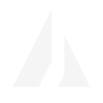

# cdx terminal design

cdx uses the dev portal's black and grey theme. Blue marks active work and the branch that leads to it. State stays in words. A failed lane says `failed`; a quota hold says `blocked`. No coloured status pills, emoji, enclosing panels, or background fills.

This prototype opts in with `CDX_TUI=1`. It changes full `status` and the human `usage` table. Unset the variable to get the existing renderer. JSON, `status --line`, `--brief`, and `--watch` keep their current formats. The renderer reads no state and starts no process when imported.

## Source decisions

The portal reference is `/Users/mas/code/hyperscale-portals` at the time of this lane, 2026-09-22.

- `docs/portal-programme/design-direction.md` sets Vercel as the main reference and black, grey and white as the dev identity.
- `packages/ui/src/styles/globals.css` supplies the dark grey ramp and `--portal-navigation-blue`, `#7890ff` in dark mode.
- `packages/portal/src/brand.tsx` defines the Architect's split prism as two filled paths in a 32 by 32 viewBox.
- `packages/portal/src/brand/hyperscale-mark-white.svg` is the separate Hyperscale logo. The prism does not replace it. cdx uses the prism for the agent demo and the word `cdx` for command headings.
- `packages/portal/src/architect/lattice-loader.tsx` and its CSS use a four by four lattice with staggered highlights. The terminal version independently draws a diagonal cell wave at 108 ms per step. It does not copy the React component or its completion shapes.
- `packages/portal/src/shell.tsx` draws a vertical trunk with short curved branches and a blue selected reach. Terminal box drawing keeps the trunk and reach with square corners.
- `packages/portal/src/pixel-wipe.tsx` wipes only on an explicit mode change. Ordinary output and refreshes never need a wipe.

## Type and spacing in cells

All text uses the terminal's chosen monospace font. There are no font-size escape codes or double-height lines. A normal glyph occupies one cell; a wide grapheme occupies its measured width.

| Role | Height | Treatment | Space after |
| --- | --- | --- | --- |
| Command heading | 1 row before wrapping | Foreground, sentence case | 1 blank row |
| Lane name and state | 1 row before wrapping | Foreground | No blank row inside a lane |
| Detail and timestamp | 1 row before wrapping | Muted | No blank row |
| Section boundary | 1 blank row | Empty cells | None |
| Column gutter | 2 columns | Empty cells | None |
| Tree level | 3 columns | Trunk, reach, space | None |
| Prism | 16 columns by 8 rows | Foreground | 1 blank row in the demo |

Leave the background under terminal control. The intended terminal background is black. Do not alter Ghostty settings. Avoid bold and dim SGR because font weight and dim contrast vary across profiles. Colour and spacing carry hierarchy.

The renderer caps layouts at 160 columns and defaults to 100 when width is unavailable. It measures with `Bun.stringWidth` and wraps whole grapheme clusters. It removes terminal controls from state-derived strings before adding its own colour. At widths below 12 columns, lane blocks become a flat stream. Deep tree indentation resets before it consumes the content width; the source heading retains `parent=...`.

## Grey ramp and accent

| Token | Hex | Truecolor RGB | Use |
| --- | --- | --- | --- |
| Background | `#000000` | `0;0;0` | Intended terminal background |
| Surface | `#0a0a0a` | `10;10;10` | PNG preview backdrop only, not painted by the CLI |
| Rule | `#262626` | `38;38;38` | Single table header rule |
| Muted | `#999999` | `153;153;153` | Labels, metadata, idle lattice cells |
| Text | `#f5f5f5` | `245;245;245` | Headings, values, prism |
| Blue | `#7890ff` | `120;144;255` | Active branch and moving lattice cell |

Foreground uses `ESC[38;2;R;G;Bm` and resets with `ESC[39m`. No red or yellow threshold rows in TUI mode. Numeric usage and the existing account advice explain quota pressure. Unknown remains `?`, not zero. The dark navigation blue is lighter than the portal's light-theme `#2d4bf2` and reads against black.

## Prism

The source paths are `M4 27 16 3 16 19 12 27Z` and `M20 11 28 27H18L20 23Z`. Both text and PNG come from those polygons. Keep the unequal blades and open slit.

`prismText()` samples a 16 by 16 grid and combines each vertical pair into `▀`, `▄`, `█`, or space. This creates 16 columns by 8 rows without changing the font. Approximate cell proportions are one unit wide and two units high. Font metrics can change the apparent aspect ratio.

ASCII terminals use this small identification fallback rather than a substitute icon:

```text
  /|
 / | /
/__|/__\
```

The image is a generated 128 by 128 RGBA PNG. Four samples per pixel soften the blade edges. `prismPng()` writes PNG chunks and compresses scanlines with the runtime's `node:zlib`; there is no image package or embedded PNG byte blob. The generated artifact is [tui-prism.png](tui-prism.png).



## Status and lane tree

```text
cdx  3 lanes  2 running

└─ portal  running  work r2  gpt  supervisor
     owner  demo session
     progress  18 steps 4 files working last 9s
   ├─ usage  running  work r1  gemini  parent=portal
   │    question  #4 waiting for the reset-window rule
   └─ routes  done  work r1  gemini  parent=portal
        review  pending
        last  report /workspace/reports/routes.md
```

The displayed set still comes from cdx's running-first selection and finished-history cap. Parents precede their visible children; sibling order follows the existing recency order. Children with hidden or missing parents appear at the root. A visited set prevents cycles from hiding lanes or looping forever. Blue highlights the connector of an active lane. Completed connectors stay grey.

The prototype reuses `renderLaneBlock` content. Owner, working directory, tokens, progress, last action, question, outage, review details and report paths remain present. It strips the old magenta and status colours. Running jobs remain a separate section with the same existing ownership filter. The header counts the displayed lanes, not hidden history.

`/lanes` in Claude Code invokes status and displays captured output. That pipe gets plain ASCII even if Ghostty is the outer terminal. Set `CDX_TUI=1` in the CLI environment for the tree layout. Do not send Kitty graphics through Claude's captured command result. This lane does not alter the hook or its environment propagation.

## Usage table

Keep the existing account/window rows and formatting. Left-align account and window; right-align every metric. Use two spaces between columns and one grey rule below the header. There are no outer borders, alternating row fills, bars, or repeated account cards.

If all columns do not fit, each row becomes a block of `label  value` lines. Every column survives, including burn, projected remainder, exhaustion time, holds and tokens per percent when available. Blank lines separate windows. Advice follows the table. Machine consumers should use the existing JSON mode.

`CDX_TUI=1` does not change usage collection. The existing command still probes providers and updates its usage cache. The isolated demo imports only `tui.ts` and does neither.

## Lattice and motion

The lattice is four rows of four cells, with a one-cell horizontal gap. One diagonal lights blue on each 108 ms step. It cycles through seven diagonals. In monochrome, `■` versus `·` carries the change; ASCII uses `#` versus `.`. A label begins two columns after row two. The loader occupies four rows and updates those rows only.

`startLattice()` returns an idempotent stop function. Its caller owns the output while it runs and must call stop in a `finally` block. It never hides the cursor, changes raw mode, or enters an alternate screen. The demo stops after 864 ms and handles SIGINT and SIGTERM. Production commands do not start the loader in this prototype.

`CDX_TUI_MOTION=0`, CI, a pipe, or insufficient width produces a single static label. This avoids invented progress percentages and repeated loader lines in logs.

A future explicit switch between status and usage may reveal eight vertical cell bands over 180 ms. It must respect the motion switch and finish with the full text. Pixel wipe is design-only here. These one-shot commands have no navigation event that warrants it. Do not clear scrollback to imitate a browser transition.

## Event lines

Event rendering is design-only. Keep one append-only line per event and use its recorded timestamp. A continuation is indented under the message. Keep kind and lane identity in text, including the question number or report path when supplied.

```text
14:08:02  usage  question #4  Which reset window applies?
14:09:11  routes  done  report /workspace/reports/routes.md
14:10:06  quota  failed  provider unavailable
```

Timestamp and kind are grey. Lane and message are foreground. A new event may briefly highlight its left connector blue in a future live view. No pulse runs in an append-only feed. Preserve cdx's event ownership and JSON records. This prototype leaves `renderEvent`, `renderEventLine`, and delivery untouched.

## Report view

Report rendering is design-only. Print `report  <lane>  r<round>` in foreground, the exact report path in grey, one blank line, then the report body. Keep authored paragraphs, code blocks, lists, and line breaks. Do not manufacture success from a `done` work state; review and gate results are separate facts. If the record has no gate result, say unavailable only in metadata, never insert a claim into the report body.

No Markdown widget or pager is needed. A future coloured report reader must remove embedded terminal control sequences while preserving line breaks. `cdx report` and `wait --report` remain unchanged in this lane.

## Graphics and fallback

Ghostty's [feature documentation](https://ghostty.org/docs/features) confirms Kitty image support. The [Kitty specification](https://sw.kovidgoyal.net/kitty/graphics-protocol/) defines PNG transmission and chunking. The prototype uses a static image, not protocol animation.

`inlinePrism()` sends `ESC_Ga=T,t=d,f=100,q=2,C=1,c=16,r=8,m=...;payload ESC\`. Base64 chunks are at most 4096 bytes; continuation chunks contain only `m`. The final chunk sets `m=0`. `q=2` suppresses terminal replies. `C=1` leaves cursor movement to the caller, which emits eight newlines to reserve the image rows. Direct transmission needs no shared path between client and terminal. No fixed image ID can overwrite an unrelated placement.

Detection is passive and conservative. Output must be a TTY, with `TERM_PROGRAM=ghostty`, `TERM=xterm-ghostty`, or `TERM=xterm-kitty`. Known multiplexers disable images even when inherited variables name Ghostty. `CDX_TUI_GRAPHICS=0` forces the text mark. `NO_COLOR` disables colour and images. `TERM=dumb` and redirected stdout produce ASCII without escape sequences or animation. `CDX_TUI_ASCII=1 CDX_TUI_GRAPHICS=0` forces the ASCII mark on a TTY.

Truecolor is accepted from the known terminal identities or `COLORTERM=truecolor|24bit`. Other terminals get monochrome instead of a guessed 256-colour ramp. Images need both the known identity and colour enabled. There is no terminal-background query; use `NO_COLOR` on a light profile.

The protocol recommends an `a=q` query followed by primary device attributes for active detection. That needs a reader for terminal replies. This prototype does not take stdin away from cdx or Claude. Environment detection can be stale across SSH and unrecognised wrappers. Use the graphics-off switch there. Interactive query negotiation, multiplexer passthrough, and real Ghostty visual acceptance remain future work.

## Run the prototype

From this worktree:

```sh
bun tui-demo.ts
CDX_TUI=1 bun cdx.ts status
CDX_TUI=1 bun cdx.ts usage
CDX_TUI=1 bun cdx.ts status --json
CDX_TUI_GRAPHICS=0 CDX_TUI_MOTION=0 bun tui-demo.ts
NO_COLOR=1 bun tui-demo.ts
```

The demo always writes `docs/tui-prism.png` beside this document. On Ghostty it prints the PNG inline, sample status and usage, and a short lattice animation. With redirected output it writes only plain text to stdout. All demo values are labelled sample data.

Runtime references used while writing are [Bun string width](https://bun.sh/docs/runtime/utils#bun-stringwidth), [Node zlib](https://nodejs.org/api/zlib.html#zlibdeflatesyncbuffer-options), [Node terminal-control stripping](https://nodejs.org/api/util.html#utilstripvtcontrolcharactersstr), and the [PNG specification](https://www.w3.org/TR/png-3/). Context7 lookup failed with `fetch failed`; official documentation supplied the fallback. No dependency was added.
